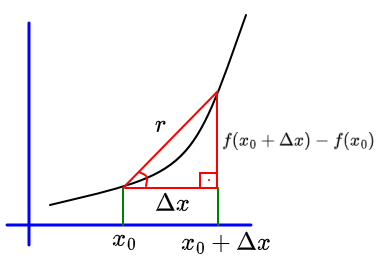

# Ementa

Unidade 1: Diferenciação
Unidade 2: Integração
Unidade 3: Autovalores e Autovetores
Unidade 4: Problemas de Valores Iniciais
Unidade 5: Problemas de Valores de Contorno

Prova 1: Unidade 1 e 2
Prova 2: Unidade 3
Prova 3: Unidades 4 e 5

# Diferenciação

Existem 3 tipos de filosofia para fazer o cálculo de derivadas. A **Forward**, a **Backward** e a **Central**.

## Foward

Seja f(x) uma função sobre x.

A derivada de f(x) é:

$$\boxed{\Large f'(x) = \frac{df(x_0)}{dx}=\lim_{\Delta x \to 0} \frac{f(x_0-\Delta x)-f(x_0)}{\Delta x}}$$

Ora, se a tg do ângulo é o cateto oposto sobre o cateto adjacente, então temos

$$\boxed{\Large \frac{f(x_0+\Delta x) - f(x_0)}{\Delta x}}