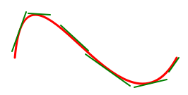
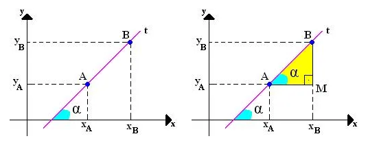
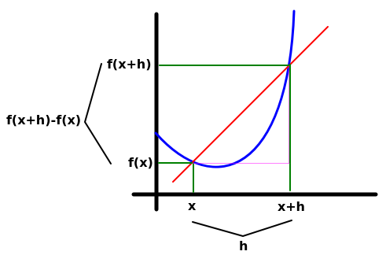
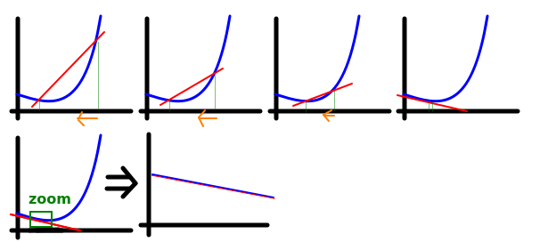

# Referência pro tópico

https://www.youtube.com/watch?v=-ktrtzYVk_I&list=PL3j1ntBPCU_om5O1RBi5-vDRwVTvDwyeV&ab_channel=NancyPi

# Derivada

Definição informal: é uma função que diz a inclinação da reta tangente da curva em qualquer ponto do gráfico.

Ela basicamente diz a variação instantânea em qualquer ponto.

Perceba as retas tangentes. São infinitas tangentes, e sua inclinação muda em quaisquer pontos infinitesimais.

Se fosse uma reta no lugar dessa curva, teriamos facilmente o valor da distância da inclinação apenas usando o cálculo do coeficiente angular, que nada mais é do que a tg do ângulo $\alpha$ para qualquer ponto da reta:

E assim obtemos a relação de cateto oposto sobre adjacente para achar a distância de A para B, e isso vale pra qualquer ponto da reta, que é o coeficiente angular:

$$\Large\boxed{m = \tg \alpha = \frac{y_B-y_A}{x_B-x_A} = \frac{\Delta y}{\Delta x}}$$

O problema é que não dá pra saber para todos os pontos de uma curva a inclinação da reta tangente, pois para todo ponto, a tangente muda a todo instante.

Então como vamos achar a inclinação em todos os pontos, se todo tempo a tangente está mudando e só temos um ponto como referência?

É aí que a derivada entra.

# Definição da derivada

Suponha um gráfico (azul).

 Quero descobrir a reta tangente de um ponto aleatório dessa curva. O ponto que quero trabalhar está representado como $x$. Traço uma reta secante (vermelha) que passa por $x$ e por qualquer outro ponto do gráfico a uma distância $h$ de $x$.

 Observando a reta secante, percebe-se um triângulo feito. Usando-se da fórmula do coeficiente angular, temos que:

$$m = \frac{f(x+h)-f(x)}{(\cancel{x}+h)-\cancel{x}} \Rightarrow \boxed{\frac{f(x+h)-f(x)}{h}}$$

Essa é a fórmula da inclinação da secante. Porém, ela é inútil, dado que nós não temos um gráfico reto, e sim um gráfico curvo. Ela é uma aproximação bem mediana da curva do gráfico.

Pra resolver isso, nós aproximamos o x+h de x, diminuindo o tamanho de h de forma a tender a zero.

Quanto mais perto h fica de zero, mais x+h se aproxima de x, e melhor a precisão da nossa reta secante, até o ponto em que a reta secante irá infinitesimalmente equivaler a reta tangente. 

Basta imaginar um zoom no gráfico tendendo ao infinito, pois a curva vai cada vez mais virar uma reta, e como já se viu, o coeficiente angular em um gráfico reto nos dá a resposta para qualquer ponto do gráfico

Portanto, o limite da reta secante é a reta tangente.

$$m_{lim} = \lim_{h \to 0} \frac{f(x+h)-f(x)}{h}$$

Chegamos na definição de derivada.

$$\Large\boxed{f'(x) = \lim_{h \to 0} \frac{f(x+h)-f(x)}{h}}$$

A fórmula é válida quando o limite existe.

Por conta do fato da reta tangente sempre mudar em qualquer lugar, é variável, e por isso a função derivada é uma função, assim como a função original é uma função.

A derivada diz sobre a reta em qualquer lugar. O quão inclinada, crescente, e ao substituir o x da derivada, você descobre a taxa de variação naquele ponto.
