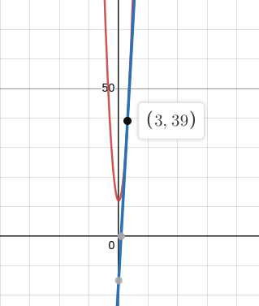
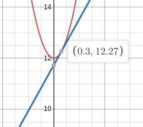
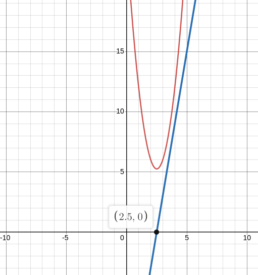
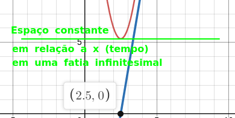
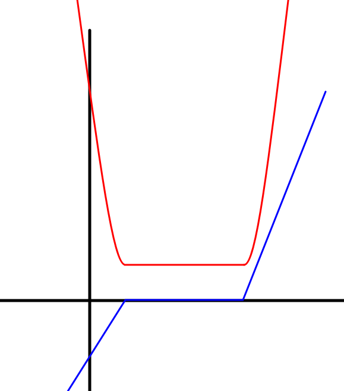
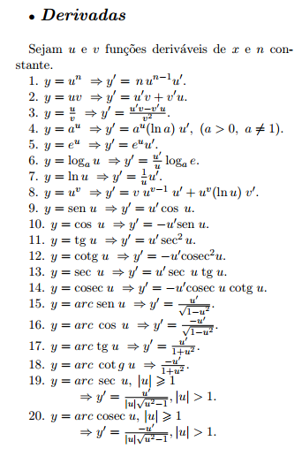

# Referência pro tópico

https://www.youtube.com/watch?v=-ktrtzYVk_I&list=PL3j1ntBPCU_om5O1RBi5-vDRwVTvDwyeV&ab_channel=NancyPi

# Derivada

Definição informal: é uma função que diz a inclinação da reta tangente da curva em qualquer ponto do gráfico.

Ela basicamente diz a variação instantânea em qualquer ponto.

Perceba as retas tangentes. São infinitas tangentes, e sua inclinação muda em quaisquer pontos infinitesimais.

Se fosse uma reta no lugar dessa curva, teriamos facilmente o valor da distância da inclinação apenas usando o cálculo do coeficiente angular, que nada mais é do que a tg do ângulo $\alpha$ para qualquer ponto da reta:

E assim obtemos a relação de cateto oposto sobre adjacente para achar a distância de A para B, e isso vale pra qualquer ponto da reta, que é o coeficiente angular:

$$\Large\boxed{m = \tan \alpha = \frac{y_B-y_A}{x_B-x_A} = \frac{\Delta y}{\Delta x}}$$

O problema é que não dá pra saber para todos os pontos de uma curva a inclinação da reta tangente, pois para todo ponto, a tangente muda a todo instante.

Então como vamos achar a inclinação em todos os pontos, se todo tempo a tangente está mudando e só temos um ponto como referência?

É aí que a derivada entra.

# Definição da derivada

Suponha um gráfico (azul).

 Quero descobrir a reta tangente de um ponto aleatório dessa curva. O ponto que quero trabalhar está representado como $x$. Traço uma reta secante (vermelha) que passa por $x$ e por qualquer outro ponto do gráfico a uma distância $h$ de $x$.

 Observando a reta secante, percebe-se um triângulo feito. Usando-se da fórmula do coeficiente angular, temos que:

$$m = \frac{f(x+h)-f(x)}{(\cancel{x}+h)-\cancel{x}} \Rightarrow \boxed{\frac{f(x+h)-f(x)}{h}}$$

Essa é a fórmula da inclinação da secante. Porém, ela é inútil, dado que nós não temos um gráfico reto, e sim um gráfico curvo. Ela é uma aproximação bem mediana da curva do gráfico.

Pra resolver isso, nós aproximamos o x+h de x, diminuindo o tamanho de h de forma a tender a zero.

Quanto mais perto h fica de zero, mais x+h se aproxima de x, e melhor a precisão da nossa reta secante, até o ponto em que a reta secante irá infinitesimalmente equivaler a reta tangente. 

Basta imaginar um zoom no gráfico tendendo ao infinito, pois a curva vai cada vez mais virar uma reta, e como já se viu, o coeficiente angular em um gráfico reto nos dá a resposta para qualquer ponto do gráfico

Portanto, o limite da reta secante é a reta tangente.

$$m_{lim} = \lim_{h \to 0} \frac{f(x+h)-f(x)}{h}$$

Chegamos na definição de derivada.

$$\Large\boxed{f'(x) = \lim_{h \to 0} \frac{f(x+h)-f(x)}{h}}$$

A fórmula é válida quando o limite existe.

Por conta do fato da reta tangente sempre mudar em qualquer lugar, é variável, e por isso a função derivada é uma função, assim como a função original é uma função.

A derivada diz sobre a reta em qualquer lugar. O quão inclinada, crescente. E ao substituir o x na derivada, você descobre a taxa de variação naquele ponto.

### Exemplo: calcular a derivada de $f(x) = 3x^2 + 12$

A forma correta e original de calcular a derivada de uma função $f$ é substituindo a função na fórmula da definição de derivada:

$\large f'(x) = \lim_{h \to 0} \frac{3(x+h)^2+12-(3x^2+12)}{h}$

$\large = \lim_{h \to 0} \frac{3(x^2+2xh+h^2)+12-3x^2-12}{h}$

$\large = \lim_{h \to 0} \frac{\cancel{3x^2} + 6xh + 3h^2\cancel{+ 12}\cancel{-3x^2}\cancel{-12}}{h}$

$\large = \lim_{h \to 0} \frac{3\cancel{h}(2x+h)}{\cancel{h}} = \lim_{h \to 0} 3(2x+h) = \boxed{6x}$

Portanto, a derivada de $3x^2 + 12$ é $6x$. O que isso nos diz? Basicamente diz que se eu substituir $x$ por algum número na derivada, eu obtenho a inclinação da reta tangente à função original naquele ponto. Ou seja, a taxa de variação infinitesimal naquele ponto exato com relação à $x$.

Pra saber a taxa de variação naquele ponto $x$, usa-se portanto a inclinação da linha tangente naquele ponto, substituindo $x$ da função derivada.

Suponha que eu substitua $x$ por 3 em $f'$. $f'(x) = 6 \cdot 3 = 18$. O que 18 nos diz? Representa a inclinação da reta tangente no gráfico da função $f(x) = 3x^2 + 12$ no ponto $x = 3$. O valor 18 em si no gráfico diz o quão a função tá mudando em uma posição particular. Nesse caso, a função tá mudando bastante com $x = 3$, indicado pelo fato de que a inclinação da reta tangente deu 18. Ou seja, significa que no ponto $x = 3$, a função original tá mudando em uma variação de 18 unidades de y por unidade de x.

Ou seja, o valor da derivada em um ponto particular diz a taxa de variação instantânea em um ponto, e a inclinação da reta tangente no gráfico naquele ponto representa visualmente a variação de mudança.

E pra saber o ponto que essa tangente está e o quão inclinada ela é, basta substituir 3 na função f(x), que resulta em 39. Ou seja, no par ordenado $(3,39)$ está localizada uma tangente a nossa escolha no ponto $x = 3$. Sabendo agora do par ordenado, vamos usar a fórmula do coeficiente angular: $(y-y_0) = m(x-x_0)$, afinal essa tangente é uma reta.

Substituindo as coordenadas x_0 e y_0 (pois temos o ponto inicial) baseados no par ordenado, e $m$ pelo resultado da função derivada, temos:

$\large y-39 = 18(x-3) \Rightarrow y = 18x - 54 + 39 \Rightarrow y = 18x - 15$

A reta tangente ao ponto $(3,39)$ da parábola segue a função $y = 18x - 15$. Ou seja, sabemos a inclinação a partir disso e sabemos visualmente onde a tangente toca visualmente no gráfico no ponto $x = 3$.

Outro exemplo prático, suponha que eu quero a inclinação da reta tangente no ponto $x = 0.3$.

Fazendo $f(0.3)$ e $f'(0.3)$, obtemos 12.27 e 1.8. Sabendo que o par ordenado da tangente é $(x_0,y_0) = (0.3,12.27)$ e o coeficiente $m$ no limite é 1.8, substituindo na equação do coeficiente angular da reta, temos:

$\large y-12.27 = 1.8(x-0.3) \Rightarrow y = 1.8x - 0.54 + 12.27 \Rightarrow y = 1.8x + 11.73$

Ou seja, a reta tangente ao ponto $(0.3,12.27)$ da parábola segue a função $y = 1.8x + 11.73$, que por sua vez é essa reta que toca tangenciando esse ponto do gráfico:

### Exemplo 2: aplicação em física

Basta imaginar que essa função $f$ é uma função que representa o espaço percorrido de um carro. Sabemos que a relação do espaço com a aceleração se dá por meio da fórmula:

$$x(t) = x_0 + v_0(t-t_0) + \frac{a}{2}(t-t_0)^2$$

que é uma função de ordem 2 com relação ao tempo. O $x$ nesse caso seria o espaço, e o $t$ seria o $x$ na função original.

Derivando, temos:

$$v = \frac{d x}{dt} = \frac{d}{dt}(x_0 + v_0t + \frac{1}{2}t^2) = 0 + v_0 + at$$

> Nota: $v$ por definição é a derivação da função do espaço acima. Por isso já igualei a v de início. É definição.

Portanto, temos a fórmula da velocidade:

$$\boxed{v = v_0 + at \Rightarrow a = \frac{\Delta v}{t}}$$

Pegamos um espaço $x$ e derivamos em relação a um $t$ infinitesimal, ao ponto de que obtemos a velocidade "média" naquele infinitésimo intervalo de tempo, que é a própria velocidade naquele ponto (velocidade instantânea)

Obviamente, se a aceleração for zero, temos uma função linear, pois a aceleração zera e o termo da aceleração fica zero:

$$x = x_0 + v_0t + \cancel{\frac{a}{2}t^2}$$

E como não tem aceleração, a velocidade inicial é a mesma da final, portanto:

$$\boxed{x = x_0 + vt \Rightarrow v = \frac{\Delta x}{t}}$$

### Exemplo 3: aplicação em física também

Suponha uma função $f(x) = 3x^{2}-15x+24$. Sua derivada é $6x-15$

O que isso nos diz? Basicamente a parábola representa o espaço percorrido (por um veículo, exemplo), e a reta representa a velocidade, pois a velocidade é a primeira derivada do espaço em relação ao tempo, que resulta em uma linha reta (a derivada de uma função de ordem 2 resulta em uma função de ordem 1). A abscissa $x$ é o tempo.

Porém, a reta inclinada significa que existe uma aceleração. Conforme $x$ cresce (tempo), a velocidade vai de marcha ré (negativa) até pra frente (positiva) com uma aceleração constante, em relação a um referencial estacionado na terra. Perceba que a velocidade f'(x) é negativa em certo ponto $x < 2.5$, até o ponto em que o espaço para de ser percorrido (vértice da parábola, $x = 2.5$), o que significa velocidade zero naquele ponto. E nesse momento, o espaço para de ser percorrido (vértice da parábola). Depois o espaço volta a ser percorrido em sentido crescente quando a velocidade é $x > 2.5$.

Observe que na vértice da parábola, a tangente (em verde) é justamente uma linha reta horizontal, que é quando a velocidade atinge $v = 0$ quando $x = 2.5$. Ou seja, com velocidade zero, o espaço fica constante (o veículo não anda) naquele ponto infinitesimal de tempo, e por isso a linha tangente é reta horizontalmente. Se de fato não fosse infinitesimal, e sim a velocidade fosse zero durante pelo menos bastante tempo, a parábola do espaço desceria e depois ficaria constante, assim:

Essa é a ideia de tangentes em pontos infinitesimais de uma curva.

O fato da parábola ser crescente cada vez mais tem a ver com o fato de que quanto maior a velocidade, mais espaço será percorrido durante um intervalo de tempo estimado.

# Regras (atalhos) de derivação

## Regra da Potência

A regra da potência consiste em pegar um termo de uma função, multiplicar o termo pelo seu expoente e subtrair -1 da potência. Assim:

$$\Large \boxed{\frac{d}{dx}(x^n) = nx^{n-1}}$$

Fazendo termo a termo de uma função $f$, quando possível, acharemos a derivada da função.

### Exemplo: ache a derivada de $f(x) = x^4 + 2x^3 - x^2 + 4x -1$

**Solução:**

$f'(x) = 4x^{4-1}+3\cdot 2x^{3-1}-2\cdot x^{2-1}+1\cdot 4x^{1-1}-\cancel{0\cdot 1x^{0-1}}$

$\boxed{f'(x) = 4x^3+6x^2-2x+4}$

### Exemplo 2: ache a derivada de $f(x) = x^{-2}$ e $g(x) = x^{\frac{4}{3}}$

**Solução:**

$f'(x) = -2x^{-3}$

$g'(x) = \frac{4}{3}x^{\frac{4}{3}-1} = \frac{4}{3}x^{\frac{1}{3}}$

### Exemplo 3: convenções

$\frac{d}{dx}(cx) = c$

$\frac{d}{dx}(x) = 1$

$\frac{d}{dx}(c) = 0$

>Nota: $c$ é uma constante.

## Regra do Produto

Quando tem uma função com termos fatorados do tipo $(u)(v)$, ou duas funções multiplicando $f(x)\cdot g(x)$, usamos a regra do produto, que consiste no produto do primeiro termo original pela derivada da segunda, isso somando com o produto do segundo termo orignal pela derivada da primeira.

$$\Large \boxed{\frac{d}{dx}(u\cdot v) = u\frac{dv}{dx}+v\frac{du}{dx}}$$

$$\Large \boxed{\frac{d}{dx}(f(x)\cdot g(x)) = f(x)\cdot g'(x) + g(x)\cdot f'(x)}$$

### Exemplo: calcule a derivada de y = (x^2+1)(x^3+x+5)

**Solução**

$\frac{dy}{dx} = (x^2+1)(3x^2+1)+(x^3+x+5)(2x)$

$\frac{dy}{dx} = 5x^4 + 6x^2 + 10x + 1$

## Regra do Quociente

Quando tem uma função com divisão de polinômios, podemos derivar usando a regra do quociente baseado nessa fórmula:

$$\Large \boxed{\frac{d}{dx}(\frac{u}{v}) = \frac{v\frac{du}{dx}-u\frac{dv}{dx}}{v^2}}$$

$$\Large \boxed{\frac{d}{dx}[\frac{f(x)}{g(x)}] = \frac{g(x)f'(x)-f(x)g'(x)}{[g(x)]^2}}$$

se $v \neq 0$ e $g(x)\neq 0$.

### Exemplo: ache a derivada de $f(x) = \frac{x^2+1}{3x-2}$

**Solução**

$f'(x) = \frac{(3x-2)(2x) - (x^2+1)(3)}{(3x-2)^2}$

$= \frac{6x^2-4x-3x^2-3}{(3x-2)^2} = \boxed{\frac{3x^2-4x-3}{(3x-2)^2}}$

## Regra da Cadeia

A regra da cadeia consiste na seguinte regra:

$$\Large \boxed{y = f[g(x)] \Rightarrow y' = f'[g(x)]\cdot g'(x)}$$

$$\Large \boxed{y = f(u), u = g(x) \Rightarrow \frac{dy}{dx} = \frac{dy}{du}\cdot \frac{du}{dx}}$$

> Nota: os dois são a mesma coisa, assim como nas regras anteriores. São apenas duas formas de representar.

Basicamente deriva o que estiver fora da função, deixando o que tiver dentro em paz. Depois multiplica pela derivada do que tiver dentro.

### Exemplo 1: achar a derivada de $y = (3x+1)^7$

**Solução**

Perceba uma função implícita dentro da outra.

$\frac{dy}{dx} = 7(3x+1)^6\cdot 3 = \boxed{21(3x+1)^6}$

### Exemplo 2: achar a derivada de $y = \sin (x^2-3x)$

Funções trigonométricas, logaritmicas, exponenciais, tudo isso são aplicadas as regras da cadeia. $sin x$ não há necessidade de aplicar a regra (ou pode, mas é redundante). Mas a partir do momento que você tem $\sin x^2$ ou $\sin 3x$, já se tem funções implicitas em cadeia (daí o nome).

**Solução**

$\boxed{\frac{dy}{dx} = \cos (x^2-3x)(2x-3)}$

### Exemplo 3: funções nested, achar a derivada de $y = (1+\cos 2x)^2$

Nesse caso aqui temos um emaranhado de funções, pelo menos 3 uma dentro das outras. Pra isso, a regra da cadeia vai derivando tudo.

$y' = 2(\cos (2x)+1)\cdot (\frac{d}{dx}[\cos (2x)] + \frac{d}{dx}1)$

$= 2(\cos (2x)+1)\cdot ((-\sin (2x))\cdot \frac{d}{dx}(2x)+0)$

$= -2(\cos (2x)+1)\cdot 2 \cdot \frac{d}{dx}(x)\sin (2x) = \boxed{y' = -4(1+\cos 2x)\sin 2x}$

### Exemplo 4: funções diversas

$e^{3x}$, $\ln{5x}$, $\sqrt{x^2+1} = (x^2+1)^{1/2}$ são alguns exemplos de funções que é possível aplicar a regra da cadeia.

# Tabela de derivadas

