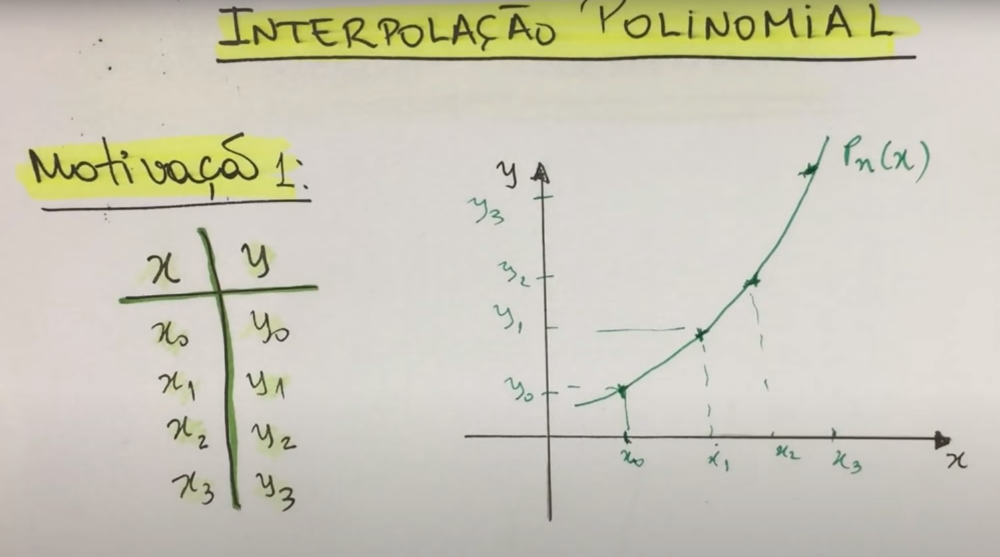
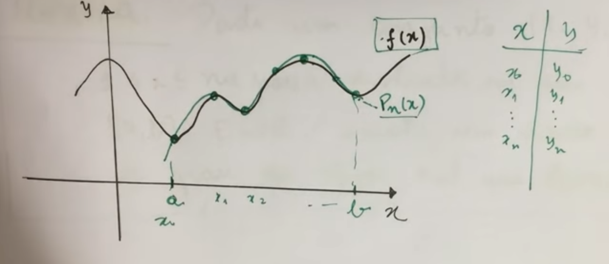
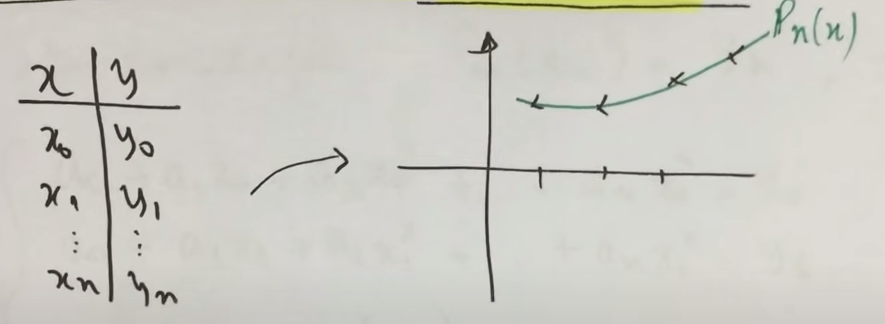
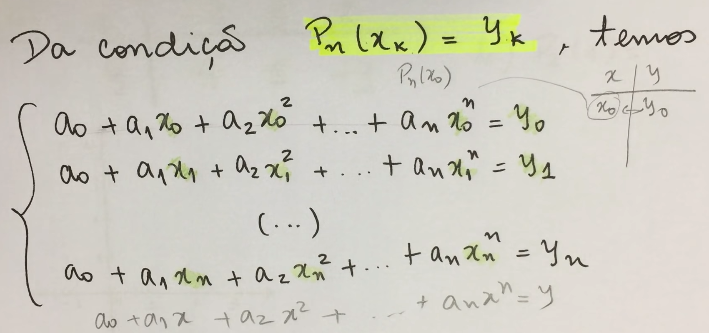
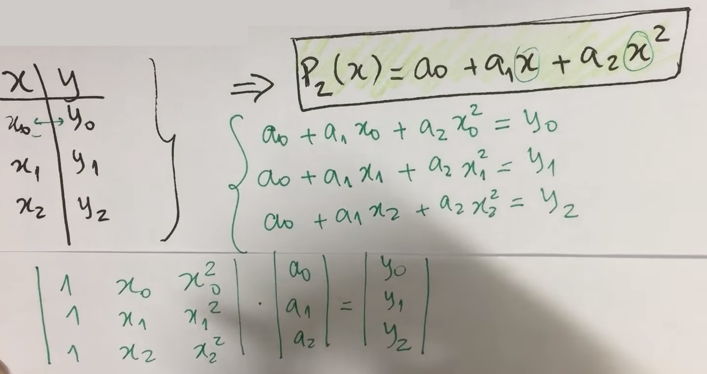
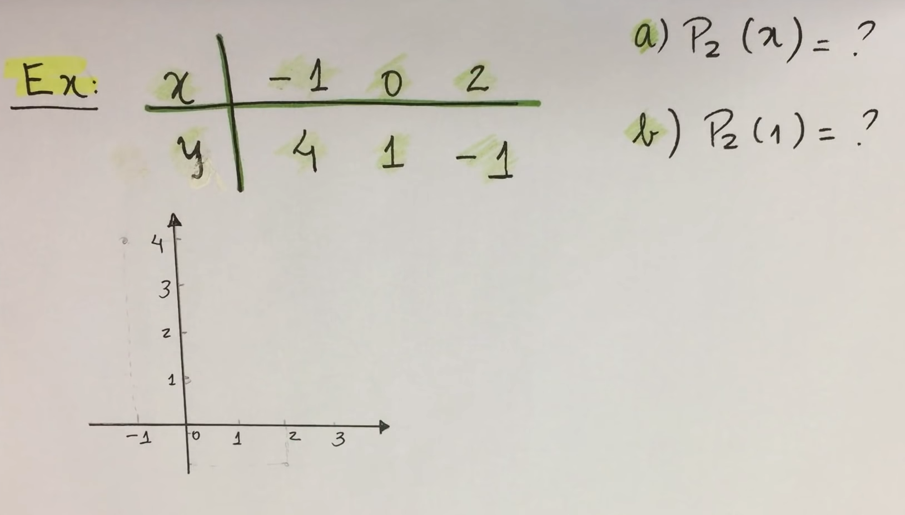
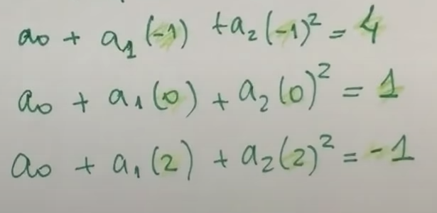
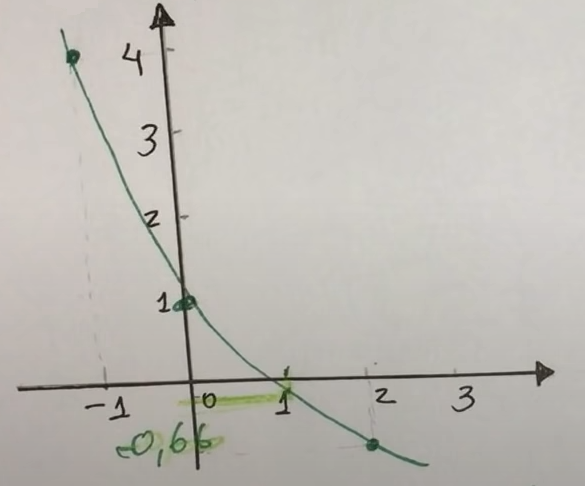

# Interpolações

Esse arquivo é uma revisão dos dois métodos numéricos de interpolação polinomial vistos em cálculo numérico 1:

- Interpolação de Lagrange
- Interpolação de Newton

Fonte: https://www.youtube.com/watch?v=-xGbO2BhL9I&ab_channel=Matem%C3%A1ticaUniversit%C3%A1ria

# Início

## Motivação 1: 

Dada 4 coordenadas $x$ e $y$, podemos interpolar esses pontos no gráfico para ter uma aproximação (linear ou não) do comportamento de uma função.

## Motivação 2:

Podemos ilustrar também por $n$ pontos uma aproximação dessa função (em verde).

Se pegarmos alguns pontos $x$ e $y$ e jogarmos no polinônio $P_n(x)$, podemos desenhar um novo gráfico baseado nesse comportamento:

## Teorema da Interpolação Polinomial

- **Teorema**: Dado um conjunto de pontos $(x_i, y_i)$, com $1 \le i \le n+1$ pares distintos em um intervalo $[a,b]$. Então, existe um único polinômio de grau $n$, $P_n(x)$, tal que $P_n(x_i) = y$.

O que esse teorema nos diz? Nos diz que o nosso polinômio interpolador de grau $n$ terá esse formato:

$$\boxed{\Large P_n (x) = a_0 + a_1 x + a_2 x^2+...+a_n x^n}$$

Os valores $a_1, a_2, ... , a_n$ determina o formato do polinômio.

Perceba que para cada $x$, tem-se um $y$, e isso em um tabelamento resulta em uma aproximação do gráfico, e quanto maior a quantidade de pontos, mais preciso será estimar o comportamento de uma função em um dado intervalo $\Delta x$ no gráfico.

## Interpolação Polinomial Quadrática

A interpolação polinomial quadrática se refere ao polinômio de grau 2, dado 3 pontos no mínimo.

Perceba nessa ilustração o seguinte: o tabelamento dos 3 pontos, o polinômio quadrático, e os possíveis casos aplicando esses pontos. 

Sabendo os valores de $x_{0~2}$ e $y_{0~2}$, temos apenas que descobrir os valores de $a_{0~2}$ utilizando de um sistema linear, chamado de **Matriz de Vandermonde**.

Baseado nisso, descobriremos os coeficientes que são uma aproximação do que seria o polinômio de interpolação, mas não é um resultado analítico (exato), porém aproximado de como seria o gráfico da função baseado nos coeficientes estimados.

### Exemplo: Interpolação básica quadrática

**Solução**

Resposta do sistema linear: $a_0 = 1$, $a_1 = -\frac{7}{3}$, $a_2 = \frac{2}{3}$.

Substituindo no $P_2(x) = a_0 + a_1x + a_2x^2$ os coeficientes, temos:

$\boxed{P_2(x) = 1 +(-\frac{7}{3})x + \frac{2}{3}x^2}$

Um resultado aproximado de uma função de segundo grau baseado em interpolação de pontos.

Fazendo $P_2(1)$, temos:

$P_2(1) = 1 - \frac{7}{3}(1) + \frac{2}{3}(1)^2 \simeq 0.66667$

Ou seja, o comportamento da função aproximada é essa:

# Interpolação de Lagrange

