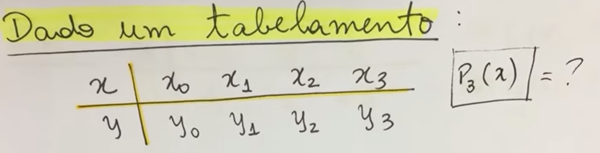
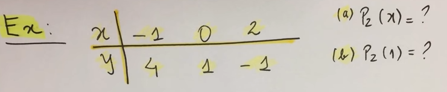
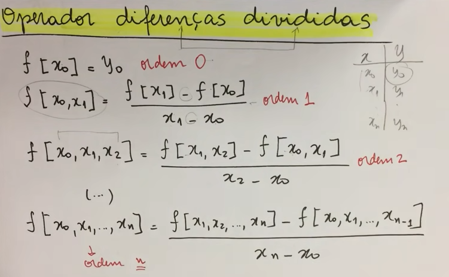
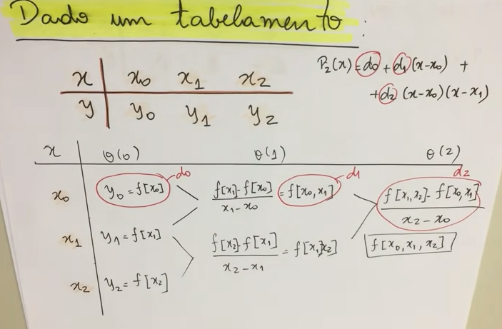
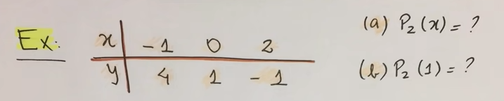
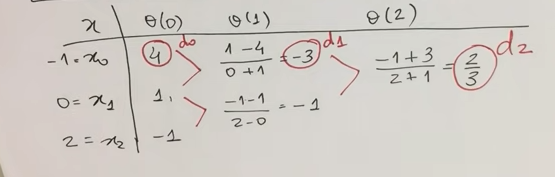

# Interpolações

Esse arquivo é uma revisão dos dois métodos numéricos de interpolação polinomial vistos em cálculo numérico 1:

- Interpolação de Lagrange
- Interpolação de Newton

Fonte: https://www.youtube.com/watch?v=-xGbO2BhL9I&ab_channel=Matem%C3%A1ticaUniversit%C3%A1ria

# Início

## Motivação 1: 

Dada 4 coordenadas $x$ e $y$, podemos interpolar esses pontos no gráfico para ter uma aproximação (linear ou não) do comportamento de uma função.

## Motivação 2:

Podemos ilustrar também por $n$ pontos uma aproximação dessa função (em verde).

Se pegarmos alguns pontos $x$ e $y$ e jogarmos no polinônio $P_n(x)$, podemos desenhar um novo gráfico baseado nesse comportamento:

## Teorema da Interpolação Polinomial

- **Teorema**: Dado um conjunto de pontos $(x_i, y_i)$, com $1 \le i \le n+1$ pares distintos em um intervalo $[a,b]$. Então, existe um único polinômio de grau $n$, $P_n(x)$, tal que $P_n(x_i) = y$.

O que esse teorema nos diz? Nos diz que o nosso polinômio interpolador de grau $n$ terá esse formato:

$$\boxed{\Large P_n (x) = a_0 + a_1 x + a_2 x^2+...+a_n x^n}$$

Os valores $a_1, a_2, ... , a_n$ determina o formato do polinômio.

Perceba que para cada $x$, tem-se um $y$, e isso em um tabelamento resulta em uma aproximação do gráfico, e quanto maior a quantidade de pontos, mais preciso será estimar o comportamento de uma função em um dado intervalo $\Delta x$ no gráfico.

## Interpolação Polinomial Quadrática

A interpolação polinomial quadrática se refere ao polinômio de grau 2, dado 3 pontos no mínimo.

Perceba nessa ilustração o seguinte: o tabelamento dos 3 pontos, o polinômio quadrático, e os possíveis casos aplicando esses pontos. 

Sabendo os valores de $x_{0~2}$ e $y_{0~2}$, temos apenas que descobrir os valores de $a_{0~2}$ utilizando de um sistema linear, chamado de **Matriz de Vandermonde**.

Baseado nisso, descobriremos os coeficientes que são uma aproximação do que seria o polinômio de interpolação, mas não é um resultado analítico (exato), porém aproximado de como seria o gráfico da função baseado nos coeficientes estimados.

### Exemplo: Interpolação básica quadrática

**Solução**

Resposta do sistema linear: $a_0 = 1$, $a_1 = -\frac{7}{3}$, $a_2 = \frac{2}{3}$.

Substituindo no $P_2(x) = a_0 + a_1x + a_2x^2$ os coeficientes, temos:

$\boxed{P_2(x) = 1 +(-\frac{7}{3})x + \frac{2}{3}x^2}$

Um resultado aproximado de uma função de segundo grau baseado em interpolação de pontos.

Fazendo $P_2(1)$, temos:

$P_2(1) = 1 - \frac{7}{3}(1) + \frac{2}{3}(1)^2 \simeq 0.66667$

Ou seja, o comportamento da função aproximada é essa:

# Interpolação de Lagrange

A interpolação de Lagrange se diferencia da interpolação básica de sistema linear para gerar um polinômio, pois ele não é tão simples, pois entrega algumas fórmulas mais bagunçadas para definir o polinômio, porém ajudam a obter uma maior precisão sobre a estimação do polinômio, já que sistemas lineares podem ser custosos assintoticamente para se resolver utilizando algoritmos, e nem sempre alguns métodos de resolução de sistemas lineares convergem.

Dado P_n(x) um polinômio, podemos escrever o Método de Lagrange como sendo:

$$\boxed{\Large \sum_{k = 0}^{n}y_kL_k(x)}$$

, onde

$$\boxed{\Large L_k(x) = \frac{\prod_{j=0, j\neq k}^{n}(x-x_j)}{\prod_{j=0, j\neq k}^{n}(x_k-x_j)}}$$

$y_k$ são os $y$ tabelados, e $L_k$ são os polinômios de Lagrange. Cada polinômio de Lagrange $L_k$ terá a mesma ordem do polinômio de $x$.

### Exemplo - Grau 3

Dado um tabelamento de $x_0$ até $x_3$, temos resultados de $y_0$ até $y_3$:

O polinômio semi-resultante seria:

$$P_3(x) = y_0L_0(x) + y_1L_1(x) + y_2L_2(x) + y_3L_3(x)$$

Perceba que posso expandir os polinômios de Lagrange $L_k$ da seguinte forma, tomando de exemplo $L_0$:

$$L_0(x) = \frac{(x-x_1)(x-x_2)(x-x_3)}{(x_0-x_1)(x_0-x_2)(x_0-x_3)}$$

Perceba que a condição de $j\neq k$ do produtório foi atingida, pois $j=0$ (primeira iteração do produtório) quando pegamos o primeiro polinômio de Lagrange, que possui $k = 0$, e assim pulamos essa iteração do produtório e verificamos as outras. Por isso não existe, na fórmula de cima nem embaixo, $(x-x_0)$ nem $(x_0-x_0)$ (que zeraria o denominador).

Fazendo o mesmo para $L_1$, $L_2$ e $L_3$, temos:

$$L_1(x) = \frac{(x-x_0)(x-x_2)(x-x_3)}{(x_1-x_0)(x_1-x_2)(x_1-x_3)}$$

$$L_2(x) = \frac{(x-x_0)(x-x_1)(x-x_3)}{(x_2-x_0)(x_2-x_1)(x_2-x_3)}$$

$$L_3(x) = \frac{(x-x_0)(x-x_1)(x-x_2)}{(x_3-x_0)(x_3-x_1)(x_3-x_2)}$$

E assim obtemos o polinômio aproximado $P_3(x)$ pelo método de Lagrange.

$P_3(x) = y_0\frac{(x-x_1)(x-x_2)(x-x_3)}{(x_0-x_1)(x_0-x_2)(x_0-x_3)} + y_1\frac{(x-x_0)(x-x_2)(x-x_3)}{(x_1-x_0)(x_1-x_2)(x_1-x_3)} + y_2\frac{(x-x_0)(x-x_1)(x-x_3)}{(x_2-x_0)(x_2-x_1)(x_2-x_3)} + y_3\frac{(x-x_0)(x-x_1)(x-x_2)}{(x_3-x_0)(x_3-x_1)(x_3-x_2)}$

### Exemplo - Com valores

Vamos usar os mesmos valores do exemplo básico de interpolação.

Usando o método de Lagrange, fica:

$$P_2(x) = 4L_0(x)+1L_1(x)-1L_2(x)$$

Resolvendo os $L$, temos:

$\Large L_0(x) = \frac{(x-x_1)(x-x_2)}{(x_0-x_1)(x_0-x_2)} = \frac{(x-0)(x-2)}{(-1-0)(-1-2)} = \frac{x^2-2x}{3}$

$\Large L_1(x) = \frac{(x-x_0)(x-x_2)}{(x_1-x_0)(x_1-x_2)} = \frac{(x+1)(x-2)}{(0+1)(0-2)} = \frac{x^2-x-2}{-2}$

$\Large L_2(x) = \frac{(x-x_0)(x-x_1)}{(x_2-x_0)(x_2-x_1)} = \frac{(x+1)(x-0)}{(2+1)(2-0)} = \frac{x^2+x}{6}$

Resultadno em:

$$\boxed{P_2(x) = 4\left(\frac{x^2-2x}{3}\right)+1\left(\frac{x^2-x-2}{-2}\right)-1\left(\frac{x^2+x}{6}\right)}$$

Para $P_2(1)$, temos:

$$\boxed{P_2(x) = 4\left(\frac{1^2-2\cdot 1}{3}\right)+1\left(\frac{1^2-1-1}{-2}\right)-1\left(\frac{1^2+1}{6}\right)  \simeq 0.66667}$$

>Nota: se aplicar a distributiva no polinômio de lagrange, resultará em: $P_2(x) = \frac{2}{3}x^2-\frac{7}{3}x+1$, o mesmo resultado usando interpolação quadrática de 3 pontos.

# Interpolação de Newton (ou diferenças divididas)

A interpolação de Newton, assim como a de Lagrange, não dá a forma resumida do polinômio usando sistemas lineares.

A fórmula é:

$$\boxed{\Large P_n(x) = d_0 + d_1(x-x_0) + d_2(x-x_0)(x-x_1) + ... + d_n(x-x_0)(x-x_1)...(x-x_n-1)}$$

, onde $d_i$, $0 \le i \le n$ é o operador de diferença dividida de ordem $i$.

Perceba que o termo $d_0$ é o termo independente. O termo com $d_1$ é o termo de primeira ordem (linear), o termo com $d_2$ é o termo de segunda ordem (quadrática) pois multiplica na distributiva $x\cdot x$, e por fim, $d_n$ é o termo de enésimo $n$ grau.

As diferenças divididas são definidas como sendo:

A escolha para $d_0, d_1, ..., d_n$ é feita através de uma tabela, onde escolhemos sempre as primeiras diferenças divididas superiores. É complicado explicar somente assim, portanto o exemplo deixará mais claro como escolher os $d$.

### Exemplo - O que seria de fato $d$?

Se eu tenho 3 pontos, então trabalho com grau 2.

Portanto, eu faria as diferenças divididas para cada ponto da seguinte forma:

E perceba que os pontos superiores são os escolhidos para definir $d_n$. Ou seja, $d$ sempre será

$\Large\boxed{d_0 = f[x_0] = y_0}$

$\Large\boxed{d_1 = f[x_0,x_1] = \frac{f[x_1]-f[x_0]}{x_1-x_0}}$

$\Large\boxed{d_2 = f[x_0,x_1,x_2] = \frac{f[x_1,x_2]-f[x_0,x_1]}{x_2-x_0}}$

$\Large\boxed{d_n = f[x_0,x_1,...,x_n] = \frac{f[x_1,x_2,...,x_n]-f[x_0,x_1,...,x_{n-1}]}{x_n-x_0}}$

Que é justamente o que é mostrado na figura antecessora a figura *2023-04-16-18-25-32.png*.

>Nota: O(n) é a ordem das diferenças.

### Exemplo - Com valores

Vamos usar os mesmos valores do exemplo básico de interpolação e que também foi usado na interpolação de Lagrange.

Por ser grau 2, expandimos até o termo de ordem 2:

$P_2(x) = d_0 + d_1(x-x_0) + d_2(x-x_0)(x-x_1)$

Veja que novamente, $x_0 = -1$, $x_1 = 0$, $x_2 = 2$, e os correspondentes $y_0 = 4$, $y_1 = 1$ e $y_2 = -1$.

Portanto, ficará assim:

$P_2(x) = d_0 + d_1(x+1) + d_2(x+1)(x-0)$

Fazendo as diferenças divididas, temos que:

Resultando em:

$$\boxed{P_2(x) = 4+(-3)(x+1)+\frac{2}{3}(x+1)(x)}$$

Fazendo $P(1)$, temos:

$$\boxed{P_2(1) = 4-3(1+1)+\frac{2}{3}(1+1)(1) \simeq 0.66667}$$

>Nota: observe que simplificar o polinômio obtido, também resultará em $\frac{2}{3}x^2-\frac{7}{3}x+1$.