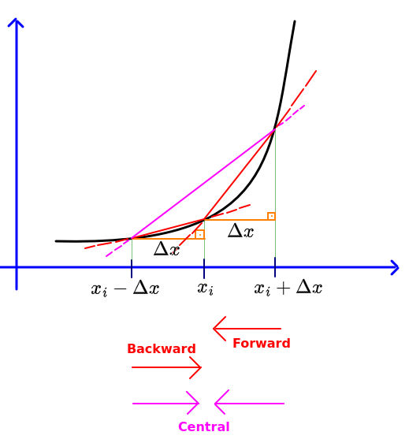
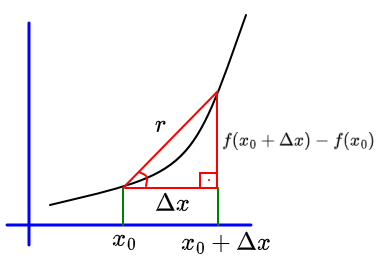
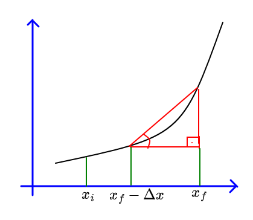
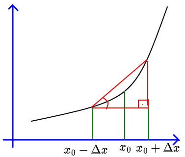
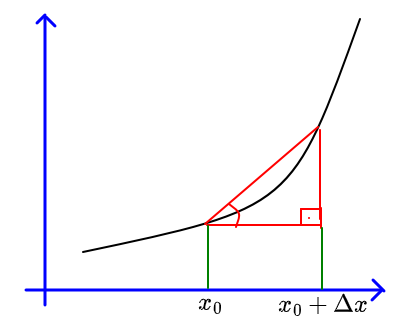
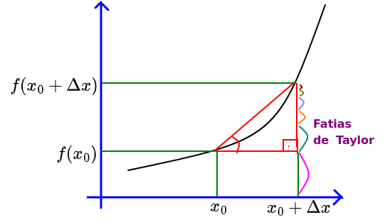

# Ementa

- Unidade 1: Diferenciação
- Unidade 2: Integração
- Unidade 3: Autovalores e Autovetores
- Unidade 4: Problemas de Valores Iniciais
- Unidade 5: Problemas de Valores de Contorno

- Prova 1: Unidade 1 e 2
- Prova 2: Unidade 3
- Prova 3: Unidades 4 e 5

# Diferenciação

Existem 3 tipos de filosofias para fazer o cálculo de derivadas. A **Forward**, a **Backward** e a **Central**.

A forward tenta aproximar a reta secante para a tangente pela direita.

A backward tenta aproximar a reta secante para a tangente pela esquerda.

A central tenta aproximar pelos dois lados a reta secante para a tangente no exato ponto médio.

## Foward

Seja f(x) uma função sobre x.

A derivada de f(x) em **Forward** é:

$$\boxed{\Large f'(x) = \frac{df(x_0)}{dx}=\lim_{\Delta x \to 0} \frac{f(x_0-\Delta x)-f(x_0)}{\Delta x}}$$

É chamado de forward, pois pega um ponto da frente de distância $\Delta x$, e se diminuirmos $\Delta x$ tendendo a zero, então a reta $r$ secante se aproxima pra trás e vira a inclinação da reta tangente.

> Nota: esse é o tipo mais utilizado no cálculo diferencial e integral.

## Backward

Seja f(x) uma função sobre x.

A derivada de f(x) em **Backward** é:

$$\boxed{\Large f'(x_f) = \lim_{\Delta x \to 0} \frac{f(x_f)-f(x_f - \Delta x)}{\Delta x}}$$

É chamado de backward, pois pega um ponto de trás de distância $\Delta x$ em relação ao ponto principal, e se diminuirmos $\Delta x$ tendendo a zero, então a reta $r$ secante se aproxima pra trás e vira a inclinação da reta tangente.

## Central

Seja f(x) uma função sobre x.

A derivada de f(x) em **Central** é:

$$\boxed{\Large f'(x_0) = \lim_{\Delta x \to 0} \frac{f(x_0+\Delta x)-f(x_0 - \Delta x)}{2\Delta x}}$$

É chamado de central, pois pega dois pontos, na frente e trás de distância $\Delta x$ em relação ao ponto principal, e se diminuirmos $\Delta x$ tendendo a zero, então a reta $r$ secante se aproxima pelos dois lados (vai pra baixo) e vira a inclinação da reta tangente.

## Derivada segunda de todas as filosofias

O algebrismo que prova as derivadas segunda estará no final desse arquivo. As fórmulas de derivada segunda são essas:

### Forward

$$\Large f''(x_0) = \frac{d^2 f(x_0)}{dx^2} = \boxed{\frac{f'(x_0 + 2\Delta x)- 2f'(x_0 + \Delta x) + f'(x_0)}{(\Delta x)^2}}$$

### Backward

$$\Large f''(x_0) =  \frac{d^2 f(x_0)}{dx^2} = \boxed{\frac{f'(x_0)-2f'(x_0-\Delta x)+f'(x_0-2\Delta x)}{(\Delta x)^2}}$$

### Central

$\Large f''(x_0) =  \frac{d^2 f(x_0)}{dx^2} = \boxed{\frac{f'(x_0 + 2\Delta x) - 2f'(x_0) + f'(x_0 - 2\Delta x)}{4(\Delta x)^2}}$

## Derivada Parcial

A derivada parcial serve para derivar funções em relação a uma ou mais variáveis.

### Exemplo:

Seja essa função f(x,y):

$f(x,y) = x^4 + 3x^3y + 4x^2y^2+6xy^3+10y^4$

Derivando sobre x, temos...

$\frac{\partial f}{\partial x} = 4x^3+9x^2y+8xy^2+6y^3$

E sobre y...

$\frac{\partial f}{\partial y} = 3x³+8x²y+18xy²+40y³$

Também é possível derivar parcialmente em função de $x^2$ e por aí em diante.

$\frac{\partial^2 f}{\partial x^2} = 12x^2 + 18xy + 8y^2$

$\frac{\partial^2 f}{\partial y^2} = 8x^2+36xy + 120y^2$

$\frac{\partial^2 f}{\partial x\partial y} = 9x^2 + 16xy + 18y^2$

$\frac{\partial^2 f}{\partial y\partial x} = 9x^2 + 16xy + 18y^2$

Perceba que os dois últimos casos são equivalentes.

## Descobrindo o $f(x_0 + \Delta x)$ apenas com $x_0$

É possível descobrir a altura total do último ponto da reta secante através de uma série de taylor.

A série consiste no seguinte

$\boxed{\large f(x_0 + \Delta x) = f(x_0) + f'(x_0)\Delta x + \frac{1}{2!}f''(x_0)\cdot(\Delta x)^2 + \frac{1}{3!}f'''(x_0)\cdot(\Delta x)^3 + \frac{1}{4!}f'''(x_0)\cdot(\Delta x)^4+...+\frac{1}{n!}f(x_0)\cdot(\Delta x)^n}$

Essa série faz com que peguemos fatias cada vez menores da altura e somamos até chegar muito próximo de $f(x_0 + \Delta x)$. Assim:

# Algebrismos Diversos

## 1 - Derivação Segunda das filosofias

- **Forward**

$\Large f''(x_0) \cong \frac{f'(x_0 + \Delta x) - f'(x_0)}{\Delta x}$

$\Large= \frac{\frac{f'(x_0 + 2\Delta x) - f'(x_0 + \Delta x)}{\Delta x} - \frac{f'(x_0 + \Delta x) - f'(x_0)}{\Delta x}}{\Delta x}$

$\Large\cong \frac{f'(x_0 + 2\Delta x)- 2f'(x_0 + \Delta x) + f'(x_0)}{(\Delta x)^2}$

- **Backward**

$\Large f''(x_0) = \frac{f'(x_0) - f'(x_0 - \Delta x)}{\Delta x}$

$\Large= \frac{\frac{f(x_0) - f'(x_0 - \Delta x)}{\Delta x} - \frac{f'(x_0 - \Delta x) - f'(x_0 - 2\Delta x)}{\Delta x}}{\Delta x}$

$\Large= \frac{1}{(\Delta x)^2}[f'(x_0)-2f(x_0-\Delta x)+f'(x_0-2\Delta x)]$

- **Central**

$\Large f''(x_0) = \frac{f'(x_0 + \Delta x) - f'(x_0 - \Delta x)}{2\Delta x}$

$\Large= \frac{\frac{f'(x_0 + 2\Delta x) - f'(x_0)}{2\Delta x} - \frac{f(x_0) - f'(x_0 - 2\Delta x)}{2\Delta x}}{2\Delta x}$

$\Large= \frac{1}{4(\Delta x)^2}[f'(x_0 + 2\Delta x) - 2f'(x_0) + f'(x_0 - 2\Delta x)]$

## 2 - Derivação Terceira das filosofias

- **Forward**

$\Large f'''(x_0) = \frac{f''(x_0 + \Delta x)- f''(x_0)}{\Delta x}$

$\Large= \frac{\frac{1}{(\Delta x)^2}[f''(x_0 + 3\Delta x) - 2f''(x_0+2\Delta x) + f''(x_0 + \Delta x) - f''(x_0 + 2x_0) + 2f''(x_0 + \Delta x) - f''(x_0)]}{\Delta x}$

$\Large= \frac{1}{(\Delta x)^3}(f''(x_0+3\Delta x)-3f''(x_0 + 2\Delta x)+ 3f''(x_0 + \Delta x) - f''(x_0))$

- **Backward**

>TODO

- **Central**

>TODO