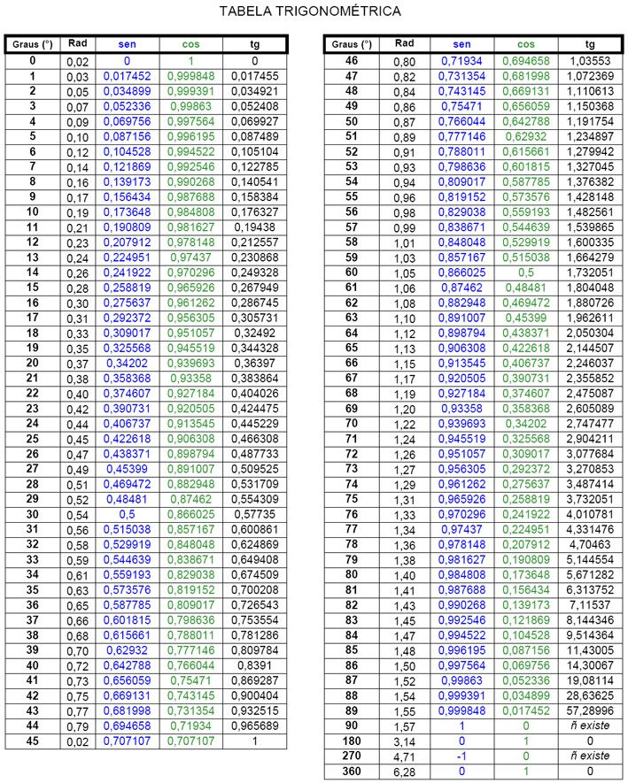
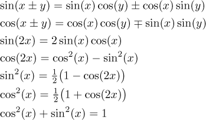

# Referência pro tópico:
https://www.youtube.com/watch?v=-l7U3dEAGa4&list=PL3j1ntBPCU_r80Qkas6hNodS_AKPM0VFM&index=1&ab_channel=NancyPi

# Inversa da função

Se a função pega x e devolve y, a inversa pega y e devolve x.

- **Exemplo:**

$\Large f(x) = y = \frac{x+2}{x}$, $x \neq 0$

Troca a posição de y por x, assim:

$\Large f(y) = x = \frac{y+2}{y}$, $y \neq 0$

Agora precisamos isolar o y a partir da troca de cima.

$\Large xy = y+2 \Rightarrow  y(x-1)=2 \Rightarrow y = \frac{2}{x-1} \Rightarrow \boxed{f^{-1}(x)=\frac{2}{x-1}}$

Essa é a função inversa de f.

# Achar a vértice da parábola

## 1 - Forma padrão

Pra descobrir o vértice de uma parábola, usamos a fórmula:

$$\Large \boxed{Vertex = \frac{-b}{2a}}$$

Seja uma equação do tipo $y = -2x^2 + 4x + 1$. Podemos escrever ela da forma $y = ax^2 + bx + c$, onde $a = -2$, $b = 4$ e $c = 1$. Para descobrir a coordenada x do vértice da parábola, basta usar a fórmula acima.

$$\Large \frac{-b}{2a}=\frac{-4}{2(-2)}=1$$

Para saber a coordenada y, basta substituir x da equação original por 1.

$$\Large y = -2(1)^2+4(1)+1 = 3$$

As coordenadas do vértice são $(1,3)$.

## 2 - Forma do vértice

A fórmula para calcular dessa forma é:

$$\Large \boxed{y = a(x-h)^2+k}$$

Se pegarmos uma equação $y = 2(x+3)^2+4$, podemos algebricar ela para encontrar $h$ e $k$, que são basicamente as coordenadas de x e y da vértice.

$$\Large y = 2(x-(-3))^2+4 \Rightarrow \boxed{(3,4)}$$

# Trigonometria

## Radianos

Radiano é definido como:

$$\Large \boxed{\theta = \frac{s}{r}}$$

Onde o $\theta$ é o ângulo constante de um setor da circunferência quando se divide o comprimento $s$ desse setor sobre o raio dessa mesma circunferência.

No caso de uma circunferência completa, o comprimento dela é $2\pi r$. E aplicando a mesma fórmula, temos que

$$\Large \theta = \frac{2\pi r}{r} = \boxed{2\pi= 360°}$$

Portanto, a circunferência completa possui ângulo $2\pi$ radianos, que equivale a 360°, a métrica antiga de graus (baseada na quantidade de dias do ano).

Pra converter de graus para radianos ou vice versa, basta usar regra de três simples, onde $2\pi$ está para $360°$, ou $\pi$ está para 180°, ou $\frac{\pi}{2}$ está para $90°$ e assim por diante.

## Seno, Cosseno, Tangente

São funções trigonométricas quando relacionam catetos (opostos e adjacentes a um ângulo) e hipotenusas em um triângulo retângulo.

Dado um triângulo retângulo e um dos seus ângulos igual a $\theta$, seno, cosseno e tangente definem-se como:

$\boxed{\Large\sin\theta = \frac{catop}{hip}}$, $\boxed{\Large\cos\theta = \frac{catadj}{hip}}$, $\boxed{\Large\tg\theta = \frac{catop}{catadj}}$

Percebeu-se que a razão entre esses valores sempre será constante dependendo do ângulo em que essas relações são feitas.

## Secante, Cossecante, Cotangente

Basicamente são o inverso das fórmulas anteriores.

$\boxed{\Large\csc\theta = \frac{1}{\sin\theta} = \frac{hip}{catop}}$,
$\boxed{\Large\sec\theta = \frac{1}{\cos\theta} = \frac{hip}{catadj}}$,$\boxed{\Large\cotg\theta = \frac{1}{\tg\theta} = \frac{catop}{catadj}}$

## Tabela trigonométrica e Propriedades

Vídeo de animação das 6 funções trigonométricas principais:

https://youtu.be/Dsf6ADwJ66E

