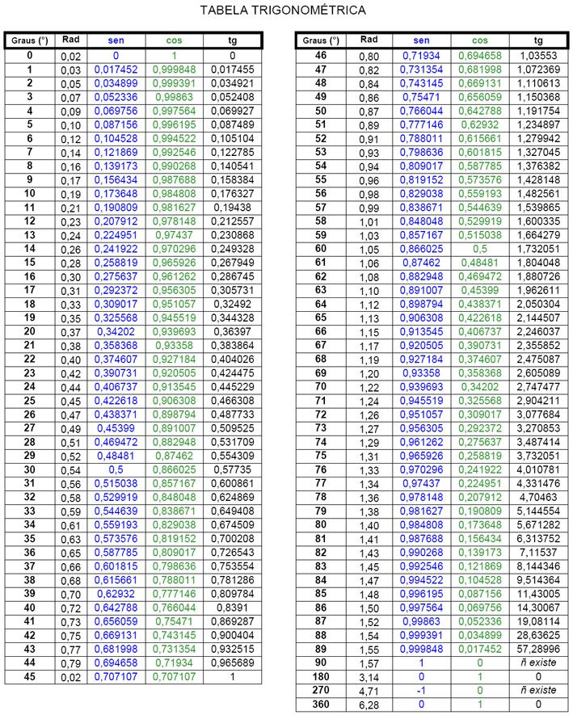
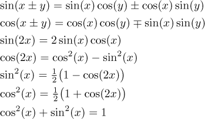
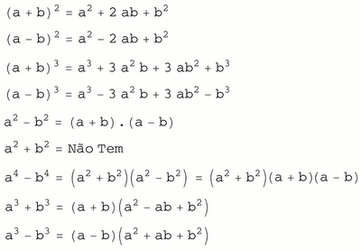
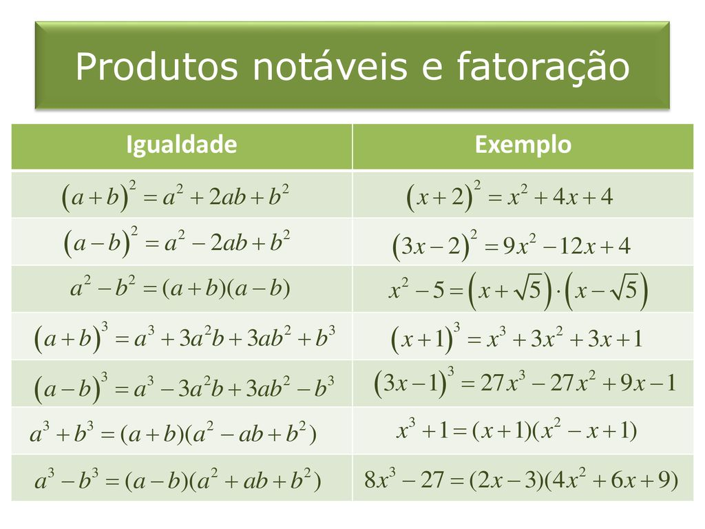
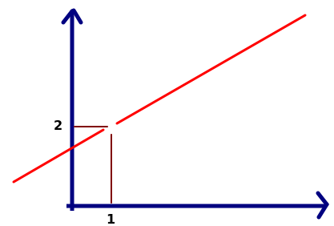
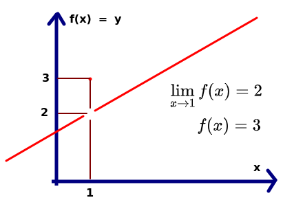
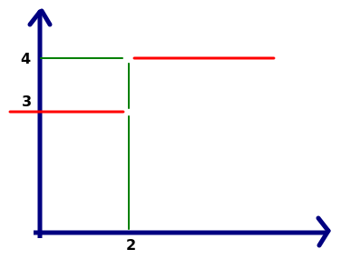
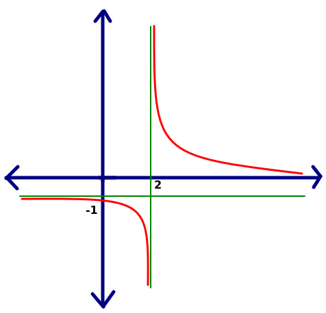
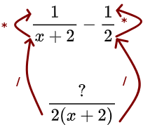

# Referência pro tópico:
https://www.youtube.com/watch?v=-l7U3dEAGa4&list=PL3j1ntBPCU_r80Qkas6hNodS_AKPM0VFM&index=1&ab_channel=NancyPi

# Inversa da função

Se a função pega x e devolve y, a inversa pega y e devolve x.

- **Exemplo:**

$\Large f(x) = y = \frac{x+2}{x}$, $x \neq 0$

Troca a posição de y por x, assim:

$\Large f(y) = x = \frac{y+2}{y}$, $y \neq 0$

Agora precisamos isolar o y a partir da troca de cima.

$\Large xy = y+2 \Rightarrow  y(x-1)=2 \Rightarrow y = \frac{2}{x-1} \Rightarrow \boxed{f^{-1}(x)=\frac{2}{x-1}}$

Essa é a função inversa de f.

# Achar a vértice da parábola

## 1 - Forma padrão

Pra descobrir o vértice de uma parábola, usamos a fórmula:

$$\Large \boxed{Vertex = \frac{-b}{2a}}$$

Seja uma equação do tipo $y = -2x^2 + 4x + 1$. Podemos escrever ela da forma $y = ax^2 + bx + c$, onde $a = -2$, $b = 4$ e $c = 1$. Para descobrir a coordenada x do vértice da parábola, basta usar a fórmula acima.

$$\Large \frac{-b}{2a}=\frac{-4}{2(-2)}=1$$

Para saber a coordenada y, basta substituir x da equação original por 1.

$$\Large y = -2(1)^2+4(1)+1 = 3$$

As coordenadas do vértice são $(1,3)$.

## 2 - Forma do vértice

A fórmula para calcular dessa forma é:

$$\Large \boxed{y = a(x-h)^2+k}$$

Se pegarmos uma equação $y = 2(x+3)^2+4$, podemos algebricar ela para encontrar $h$ e $k$, que são basicamente as coordenadas de x e y da vértice.

$$\Large y = 2(x-(-3))^2+4 \Rightarrow \boxed{(3,4)}$$

# Trigonometria

## Radianos

Radiano é definido como:

$$\Large \boxed{\theta = \frac{s}{r}}$$

Onde o $\theta$ é o ângulo constante de um setor da circunferência quando se divide o comprimento $s$ desse setor sobre o raio dessa mesma circunferência.

No caso de uma circunferência completa, o comprimento dela é $2\pi r$. E aplicando a mesma fórmula, temos que

$$\Large \theta = \frac{2\pi r}{r} = \boxed{2\pi= 360°}$$

Portanto, a circunferência completa possui ângulo $2\pi$ radianos, que equivale a 360°, a métrica antiga de graus (baseada na quantidade de dias do ano).

Pra converter de graus para radianos ou vice versa, basta usar regra de três simples, onde $2\pi$ está para $360°$, ou $\pi$ está para 180°, ou $\frac{\pi}{2}$ está para $90°$ e assim por diante.

## Seno, Cosseno, Tangente

São funções trigonométricas quando relacionam catetos (opostos e adjacentes a um ângulo) e hipotenusas em um triângulo retângulo.

Dado um triângulo retângulo e um dos seus ângulos igual a $\theta$, seno, cosseno e tangente definem-se como:

$\boxed{\Large\sin\theta = \frac{catop}{hip}}$, $\boxed{\Large\cos\theta = \frac{catadj}{hip}}$, $\boxed{\Large\tg\theta = \frac{catop}{catadj}}$

Percebeu-se que a razão entre esses valores sempre será constante dependendo do ângulo em que essas relações são feitas.

## Secante, Cossecante, Cotangente

Basicamente são o inverso das fórmulas anteriores.

$\boxed{\Large\csc\theta = \frac{1}{\sin\theta} = \frac{hip}{catop}}$,
$\boxed{\Large\sec\theta = \frac{1}{\cos\theta} = \frac{hip}{catadj}}$,$\boxed{\Large\cotg\theta = \frac{1}{\tg\theta} = \frac{catop}{catadj}}$

## Tabela trigonométrica e Propriedades

Vídeo de animação das 6 funções trigonométricas principais:

https://youtu.be/Dsf6ADwJ66E

O fato do seno ser no eixo das ordenadas (y) e o cosseno no eixo das abscissas (x), é porque o seno, por definição, é o cateto oposto (ou seja, a parte em "pé" do triângulo) pela hipotenusa. Já o cosseno é o cateto adjacente (a parte "deitada") sobre a hipotenusa.

# Produtos Notáveis e Fatoração

# Limite

A definição informal de **limite** é a previsão de qual é o valor aproximado de y (L) que conseguimos quando aproximamos x a um valor qualquer (a).

$$\Large\boxed{\lim_{x \to a} f(x) = L}$$

## Limite pelos dois lados

Suponha o gráfico a seguir:

É totalmente possível que exista um buraco no gráfico onde não sabemos o valor das coordenadas em que a função passa. Porém, podemos fazer uma projeção aproximada usando limites. A notação abaixo:

$$\lim_{x \to 1} f(x) = 2$$

Representa um resultado aproximado de y quando o valor de x se desloca para 1 de forma cada vez mais infinitesimal. Implicitamente isso ocorre tanto pela esquerda quanto pela direita, mas é possível representar esse desclocamento de forma individual, será abordado mais abaixo.

Porém, $f(1)$ é indeterminado. Não sabemos o valor exato.

Mesmo que soubessemos o valor de $f(1)$, não importa, o limite continuaria sendo 2, pois o limite estuda o que está ao redor do gráfico, e não no exato ponto.

## Limite por lados individuais

Não muito comum, mas é possível representar o limite de forma que x se aproxima pela esquerda ou pela direita apenas, e isso é mais utilizado quando temos um gráfico assim:

$\boxed{\lim_{x \to 2^-} f(x) = 3}$, $\boxed{\lim_{x \to 2^+} f(x) = 4}$

Quando temos limites quando x se aproximando da direita e da esquerda dão resultados diferentes, significa que o **limite não existe** (DNE = Does Not Exist). Ou seja:

$$\boxed{\lim_{x \to 2} f(x) = DNE}$$

## Limite pro infinito

É possível aproximar o valor de x para o infinito para descobrirmos um valor finito correspondente em uma função $f$. Porém, o contrário é DNE.

$\boxed{\lim_{x \to +\infty} f(x) = 0}$, $\boxed{\lim_{x \to -\infty} f(x) = -1}$

> Nota: quando o resultado do limite tender ao infinito (ou seja, divisão por zero), também é **DNE** Exemplo: $\lim_{x \to 0} f(x) = \frac{1}{0} = DNE$. Significa que não temos um resultado finito, e no gráfico o $f(x)$ tende ao infinito quando x é igual a zero.

# Resolução de Limites

Existem 7 formas principais pra se resolver problemas com limites.

## 1 - Plug in (substituição)

Simplesmente coloca o valor para onde x se aproxima no polinômio.

Esse é sempre o primeiro passo a se fazer ao ver um polinômio com função limite.

$\large\lim_{x \to 4} \frac{x^2-2x-3}{x^2-9} = \frac{4^2 - 2(4) - 3}{4^2-9} = \boxed{\frac{5}{7}}$

$\large\lim_{x \to 0} \sqrt{36-x^2} = \sqrt{36-0^2} = \boxed{6}$

## 2 - Fatoração

Nem sempre é possível fazer plug in de cara.

$\large\lim_{x \to 3} \frac{x^2-2x-3}{x^2-9} = \frac{3^2 - 2(3) - 3}{3^2-9} = \frac{0}{0}$

Isso não significa DNE. Só seria o caso de DNE se não tivesse outra forma de simplificar o polinômio.

Como sabemos que o **denominador não será exatamente zero**, pois x não é 3, mas muito próximo de 3, é possível fazer cancelamentos do numerador com o denominador usando fatorações.

$\large\lim_{x \to 3} \frac{x^2-2x-3}{x^2-9} = \lim_{x \to 3} \frac{\cancel{(x-3)}(x+1)}{(x+3)\cancel{(x-3)}} = \lim{x \to 3}\frac{x+1}{x+3} = \frac{3+1}{3+3} = \boxed{\frac{2}{3}}$

É possível que mesmo fatorando, não seja possível encontrar a solução e resultar em DNE.

$\lim_{x \to -1} \frac{x^2+2x-8}{x^2+5x+4} = \lim_{x \to -1} \frac{\cancel{(x+4)}(x-2)}{\cancel{(x+4)}(x+1)} = \lim_{x \to -1} \frac{x-2}{x+1} = \frac{-1-2}{-1+1} = \frac{-3}{0} = \boxed{DNE}$

## 3 - Denominador Comum

Quando temos muitas frações, as vezes é possível fazer denominador comum (mmc) para simplificar o cálculo.

$\large\lim_{x \to 0} \frac{\frac{1}{x+2}-\frac{1}{2}}{x}$

**Método 1, plug in falha ($\frac{0}{0}$)**.
**Método 2, impossível fatorar algo**.

O jeito é usar o denominador comum e se livrar das frações o máximo que puder.

Lembrando, pra fazer o denominador comum, se for números é MMC, se for polinômios, basta multiplicar eles entre si e fatorar se possível. Divide o denominador comum pelo denominador de cima, e multiplica pelo numerador. Assim:

Resultando em:

$\large = \lim_{x \to 0} \frac{\frac{2-x-2}{2(x+2)}}{x}$

E continuando a álgebra...

$\large = \lim_{x \to 0} \frac{\frac{-x}{2(x+2)}}{x} = \lim_{x \to 0} \frac{-x}{2(x+2)}\cdot \frac{1}{x} = \lim_{x \to 0} \frac{-1}{2(x+2)} = \frac{-1}{2(0+2)} = \boxed{\frac{-1}{4}}$

## 4 - Abrir os parênteses (abrir e depois simplificar)

É possível que os 3 métodos anteriores falhem. No caso se houver como fazer álgebra em torno de valores, podemos tentar fatorar algo depois que torne possível a resolução do problema.

$\large \lim_{x \to 0} \frac{(x+2)^2-4}{x} = \lim_{x \to 0} \frac{x^2+4x+4-4}{x} = \lim_{x \to 0} \frac{x^2+4x}{x} = \lim_{x \to 0} \frac{\cancel{x}(x+4)}{\cancel{x}} = \lim_{x \to 0} (x+4) = \boxed{4}$

Existem mais 3 outros métodos envolvendo radiciação, senos e módulo, porém não vou abordar aqui agora. Só se houver necessidade.