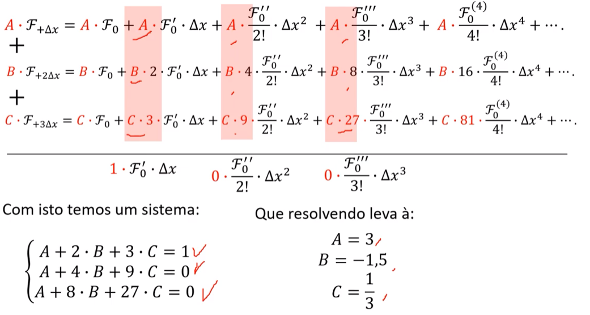

# Diferenciação 2

Como calcular a segunda derivada numérica? E a terceira?

E se eu não puder fazer perturbações para trás ou frente e quiser melhorar a ordem do erro?

São perguntas que serão respondidas nesse tópico.

# Derivada Segunda Numérica (Central)

Pra descobrir a derivada segunda numérica, eu preciso isolar o termo de derivada segunda e isolar apenas a derivada segunda, de tal forma que essa derivada segunda não fique em função de outras derivadas, pois **as outras derivadas vão compor o erro da derivada segunda.**

Se eu pegar as equações perturbadas pra frente e para trás, temos:

$f(x_0+\Delta x) = f(x_0) + f'(x_0)\Delta x + \frac{f''(x_0)}{2!}\Delta x^2 + \frac{f'''(x_0)}{3!}\Delta x^3 + \frac{f^{(4)}(x_0)}{4!}\Delta x^4+...$

$f(x_0-\Delta x) = f(x_0) - f'(x_0)\Delta x + \frac{f''(x_0)}{2!}\Delta x^2 - \frac{f'''(x_0)}{3!}\Delta x^3 + \frac{f^{(4)}(x_0)}{4!}\Delta x^4+...$

Somando elas, resulta em:

$f(x_0+\Delta x) = f(x_0) + \cancel{f'(x_0)\Delta x} + \frac{f''(x_0)}{2!}\Delta x^2 + \cancel{\frac{f'''(x_0)}{3!}\Delta x^3} + \frac{f^{(4)}(x_0)}{4!}\Delta x^4+...$

$f(x_0-\Delta x) = f(x_0) - \cancel{f'(x_0)\Delta x} + \frac{f''(x_0)}{2!}\Delta x^2 - \cancel{\frac{f'''(x_0)}{3!}\Delta x^3} + \frac{f^{(4)}(x_0)}{4!}\Delta x^4+...$

$f(x_0+\Delta x) - f(x_0-\Delta x) = 2f(x_0) + \frac{2f''(x_0)}{2!}\Delta x^2 + 2\frac{f^{(4)}(x_0)}{4!}\Delta x^4 + ...$

Isolando $f''(x_0)$:

$\Large f''(x_0) = \frac{f(x_0+\Delta x) - 2f(x_0) + f(x_0 - \Delta x)}{\Delta x^2}+\frac{1}{\cancel{\Delta x^2}}\left(-2\frac{f^{(4)}(x_0)}{4!}\cancel{\Delta x^4} - 2\frac{f^{(6)}(x_0)}{6!}\cancel{\Delta x^6}+...\right)$

Resulta em:

$$\boxed{\Large f''(x_0) = \frac{f(x_0+\Delta x) - 2f(x_0) + f(x_0 - \Delta x)}{\Delta x^2}+\left(-2\frac{f^{(4)}(x_0)}{4!}\Delta x^2 - 2\frac{f^{(6)}(x_0)}{6!}\Delta x^4+...\right)}$$

Onde o termo da esquerda é a derivada segunda numérica, e o termo da direita é o erro da derivada segunda, que é da ordem de $\Delta x^2$, pois o primeiro termo que domina o erro é $\Delta x^2$.

# O que fazer quando não tem como aplicar a filosofia central para derivada primeira numérica?

As vezes não será possível fazer o cálculo da derivada central, e precisamos recorrer a aplicação da derivada forward ou backward. Porém, a central é mais precisa que as duas citadas. 

E como fazer para que evite essa perda de precisão na forward e backward?

Simples. Lembre-se que a derivada central usa dois intervalos $\Delta x$ para frente e para trás. Como a forward e backward só usa 1 intervalo, pra aumentar a precisão, precisamos compensar colocando $2\Delta x$. Ou seja, ando mais para frente (ou trás).

**Usarei o exemplo da Forward, mas pode ser aplicado também na backward.**

Pegando duas equações, uma avançando pra frente e outra mais para frente, temos:

$f(x_0+\Delta x) = f(x_0) + f'(x_0)\Delta x + \frac{f''(x_0)}{2!}\Delta x^2 + \frac{f'''(x_0)}{3!}\Delta x^3 + \frac{f^{(4)}(x_0)}{4!}\Delta x^4+...$

$f(x_0+2\Delta x) = f(x_0) + f'(x_0)(2\Delta x) + \frac{f''(x_0)}{2!}(4\Delta x^2) + \frac{f'''(x_0)}{3!}(8\Delta x^3) + \frac{f^{(4)}(x_0)}{4!}(16\Delta x^4)+...$

Pra somar e eliminar o termo da segunda derivada (pois eu quero um erro de $\Delta x^2$), preciso multiplicar a primeira equação por -4, ficando:

$-4f(x_0+\Delta x) = -4f(x_0) + -4f'(x_0)\Delta x + \cancel{-4\frac{f''(x_0)}{2!}\Delta x^2} + -4\frac{f'''(x_0)}{3!}\Delta x^3 + -4\frac{f^{(4)}(x_0)}{4!}\Delta x^4+...$

$f(x_0+2\Delta x) = f(x_0) + f'(x_0)(2\Delta x) + \cancel{\frac{f''(x_0)}{2!}(4\Delta x^2)} + \frac{f'''(x_0)}{3!}(8\Delta x^3) + \frac{f^{(4)}(x_0)}{4!}(16\Delta x^4)+...$

E assim somo, resultando em:

$f(x_0+2\Delta x) - 4f(x_0 + \Delta x) = -3f(x_0)-2f'(x_0)\Delta x + 4\frac{f'''(x_0)}{3!}\Delta x^3 + 12\frac{f^{(4)}(x_0)}{4!}\Delta x^4+...$

Isolando a derivada primeira, temos:

$\Large\frac{4f(x_0+\Delta x)-3f(x_0)-f(x_0-2\Delta x)}{2\Delta x}+\frac{1}{\cancel{2\Delta x}}\left(\cancel{4}\frac{f'''(x_0)}{3!}\cancel{\Delta x^3} + \cancel{12}\frac{f^{(4)}(x_0)}{4!}\cancel{\Delta x^4}+...\right)$

Simplificando, resulta em:

$$\boxed{\Large \frac{4f(x_0+\Delta x)-3f(x_0)-f(x_0-2\Delta x)}{2\Delta x}+\frac{1}{2\Delta x}\left(4\frac{f'''(x_0)}{3!}\Delta x^3 + 12\frac{f^{(4)}(x_0)}{4!}\Delta x^4+...\right)}$$

Um erro de derivada progressiva de ordem $\Delta x^2$.

# Melhorando o erro

É possível aumentar a ordem do erro. Pra isso precisaremos usar mais uma equação e perturbar mais pra frente.

$f(x_0+\Delta x) = f(x_0) + f'(x_0)\Delta x + \frac{f''(x_0)}{2!}\Delta x^2 + \frac{f'''(x_0)}{3!}\Delta x^3 + \frac{f^{(4)}(x_0)}{4!}\Delta x^4+...$

$f(x_0+2\Delta x) = f(x_0) + f'(x_0)(2\Delta x) + \frac{f''(x_0)}{2!}(4\Delta x^2) + \frac{f'''(x_0)}{3!}(8\Delta x^3) + \frac{f^{(4)}(x_0)}{4!}(16\Delta x^4)+...$

$f(x_0+3\Delta x) = f(x_0) + f'(x_0)(3\Delta x) + \frac{f''(x_0)}{2!}(9\Delta x^2) + \frac{f'''(x_0)}{3!}(27\Delta x^3) + \frac{f^{(4)}(x_0)}{4!}(81\Delta x^4)+...$

Pra somar essas três equações, precisamos eliminar os termos de derivada segunda e terceira (primeira é o que eu quero), pois sempre a derivada numérica que compõe a ordem do erro pedida é a derivada $ordem+1$. Ou seja, se eu quero um erro de ordem $\Delta x^3$, preciso manter o termo com $f^{4}$ e cancelar o que vem antes de derivadas.

Perceba que uso uma técnica de cancelamento, onde compõe um sistema linear. Os coeficientes serão descobertos e saberei exatamente quais coeficientes A, B e C precisarei utilizar pra cancelar os termos da derivada segunda e terceira. Pra isso eu igualo a 1 o que eu não quero cancelar na soma, e a 0 o que eu quero cancelar.

Depois é só isolar o $f'(x_0)$ da soma resultante e descobrir a derivada.

# Resumo

Normalmente o problema irá pedir 3 coisas: a filosofia, a derivada desejada e a ordem do erro de precisão

A filosofia centrada normalmente tem uma precisão maior, portanto um erro menor, ou seja, uma ordem maior, e pela ordem maior, maior o termo fatorial, que torna o erro mais próximo de zero.

As filosofias backward e forward precisam ser compensadas e ajustadas para ter o mesmo nível de ordem da centrada.

Para derivadas back e forward, se o problema pede um erro de ordem de $k$, então a derivada que eu preciso preservar é de ordem $k+1$.

Para derivada central, se o problema pedir um erro de ordem de $k$, então a derivada que eu preciso preservar é de ordem $k$, e mesmo que $\Delta x$ seja menor em -1 em expoente, ainda sim é de ordem $k$

As outras derivadas preciso cancelar na soma, desde que eu preserve apenas a que o problema pedir, para que eu a possa isolar depois, e a derivada da ordem do erro.
