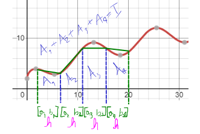
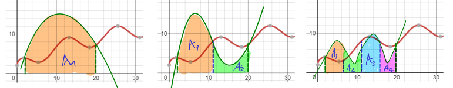

# Método de Newton-Cotes

O método de Newton-Cotes possui duas filosofias principais (fechada e aberta), e para cada filosofia, diversos graus para cálculo de integrais aproximativas (grau 1-4).

# Filosofia Fechada

## Grau 0 - Regra do ponto médio

Também chamada de fórmula do retângulo, essa é a regra de quadratura mais simples de Newton-Cotes para ser aplicada.

Dada uma função $f$ constante de ordem zero, para calcular a área, é extremamente preciso e simples, não necessitando de interpolação. Basta eu pegar os intervalos $a$ e $b$ e fazer uma integração sobre a função $f$ direta.

$$\boxed{\Large \int_{a}^{b}f(x)dx \simeq (b-a) f((a+b)/2)}$$

Podemos provar essa fórmula usando interpolação de Lagrange, expandindo para grau zero.


## Grau 1 - Regra do Trapézio

A regra do trapézio consiste em usar interpolações aproximativas (seja de Newton ou Lagrange) para aproximar a um polinômio, de tal forma que a área de diversos trapézios somados formados por esses pontos interpolados dê um resultado aproximado da integral (área total) da função $f$ em um intervalo de $a$ a $b$.


Perceba na figura que eu estou aplicando um método que cria uma divisão entre $a$ e $b$, e que isso me gera trapézios ao ligar pontos. Se eu fizer o cálculo de área dos trapézios na primeira figura $\frac{(Basemaior + basemenor)altura}{2}$ e somar as duas áreas, eu obtenho uma área aproximativa da função. Porém, perceba que foi feita somente uma divisão, com intervalo $\Delta x = h$ igualmente espaçados. E perceba que a aproximação é muito pobre, dado que foi feita somente uma divisão. Para melhorar os resultados, aplicamos mais divisões entre o intervalo $[a,b]$, com espaçamentos bem definidos $h$, e assim cada vez mais aproximamos o valor da área à função $f$ dentro do intervalo.

A regra do trapézio consiste na seguinte fórmula:

$$\boxed{\Large \int_{a}^{b}f(x)dx \simeq \frac{b-a}{2}\left(f(a)+f(b)\right)}$$

A demonstração pode ser utilizada tanto aproximando para um polinômio de Lagrange quanto pra um de Newton. Como já fiz de Lagrange pro grau 0, vou usar pra Newton dessa vez, mas pode ser feita pelas duas formas.


Para integrar a segunda expressão, usa-se a regra do produto e da potência.

Aplicar somente uma vez em muitos casos não é suficiente. Por isso precisamos particionar o problema em diversos trapézios. com bases $h$, e quanto mais particionado e menor for $h$, mais preciso o resultado.

### Exemplo: integral de $2(\sqrt{x}+\cos \left(\frac{x}{2}\right))$ entre $a = 2$ e $b = 20$

A função tem esse comportamento:


Pra obter a máxima precisão, precisamos particionar o problema diversas vezes, de tal forma que $h$ fique minúsculo e o mais próximo possível de zero. Quando isso ocorre, se temos uma tolerância a ser atingida de resultado em comparação ao resultado anterior, se for atingido, a aproximação numérica foi suficiente.

**Iteração $k = 1$**:

Começamos com 1 partição ($N = 1$) apenas, que é o próprio intervalo $[a,b]$ fechado. Ou seja, $h = b-a = 18$


Sabendo que a soma é $I = \frac{b-a}{2}\left(f(a)+f(b)\right)$, substituindo os valores de $a,b,f(a),f(b)$ fica:

$A = I = \frac{b-a}{2}\left(f(a)+f(b)\right) \simeq 100.5764$

Se a tolerância for de $10^{-3}$, dá pra iterar muito mais, e normalmente no primeiro passo não sai um bom resultado. Portanto, precisa continuar aplicando o método. Mas como? Dobrando o número de partições sempre. O motivo explico depois.

**Iteração $k = 2$**:

Para $k = 2$, agora o número de partições $N$ são 2. Ou seja, separo em dois problemas e resolvo eles de forma individual. Pra particionar, basta eu dividir o $h = b-a$ pelo número de partições, sempre. Ai terei novos "h" menores do mesmo tamanho.


Observe que $b_1 = a_2$.

Fazendo para cada trapézio, fica:

$A_1+A_2 = \frac{b_1-a_1}{2}\left(f(a_1)+f(b_1)\right) + \frac{b_2-a_2}{2}\left(f(a_2)+f(b_2)\right)\simeq 122.7435$

Observe que o resultado converge para algum valor, mas ainda aparenta impreciso, principalmente porque do resultado anterior para o de agora, o erro foi consideravelmente alto.

**Iteração $k = 3$**:

Agora para o próximo passo $k = 3$, o número de partições $N$ são 4. O motivo de sempre multiplicarmos por 2 o número de partições, é para que todos os $h$ fiquem simétricos pela metade, buscando a simetria dos intervalos.



Perceba as diagonais do trapézio cada vez mais se aproximando de $f$ quanto mais partições são feitas. E por conta disso que teremos cada vez mais um resultado aproximado de área.

O cálculo é feito da mesma forma da segunda etapa.

$A_1+A_2+A_3+A_4 = \frac{b_1-a_1}{2}\left(f(a_1)+f(b_1)\right) + \frac{b_2-a_2}{2}\left(f(a_2)+f(b_2)\right)+ \frac{b_3-a_3}{2}\left(f(a_3)+f(b_3)\right)+ \frac{b_4-a_4}{2}\left(f(a_4)+f(b_4)\right)\simeq 111.7374$

**Iteração $k = 11$**:

Obviamente que a esse ponto, fazer na mão os cálculos é extremamente trabalhoso e inviável, e por isso recorremos a um algoritmo computacional. Mas a tabela completa da convergência é essa:


Perceba que a tolerância foi atingida, e é aí que o programa para. Ou seja, a área entre 2 e 20 é de aproximadamente 110, com um erro de $10^{-3}$ máximo.

E também é possível notar que em $k = 1$ para $k = 2$, a área total sobe e depois disso ela declina. Nas figuras que apresentei aproximativas do gráfico, é possível que sim, o trapézio pode ter uma área menor, depois ao aproximar por mais trapézios, ela aumenta, e depois diminui novamente. Isso é visível a olho nu nas figuras, e é comum ocorrer quando se tem um intervalo $[a,b] = \Delta x$ cobrindo parábolas e pontos de inflexão, como dessa função $f$.

O algoritmo é esse:

```python
import math
import numpy as np


def f(x):
    return 2*(math.sqrt(x)+np.cos(x/2))


def newton_cotes_grau1_fechada(a, b, tol=1e-3):
    # Indexação
    print("{:^15}{:^15}{:^15}{:^15}{:^15}".format(
        "iteracoes", "particoes", "h", "integral", "erro"))

    # Trabalho de início apenas com 1 partição, o próprio intervalo [a,b]
    particoes = 1
    # Primeira iteração
    k = 1

    # Intervalo h de cada partição do conjunto de partições
    h = (b-a)/particoes

    # Integral
    soma = ((b-a)/2)*(f(a)+f(b))
    soma_anterior = 0  # Valor necessário pra verificar a tolerância
    soma_atual = soma  # E fazer a subtração desse com o anterior
    erro = abs((soma_atual-soma_anterior)/soma_atual)  # Erro

    # Formatação das iterações
    print("{:^15.8f}{:^15.8f}{:^15.8f}{:^15.8f}{:^15.8f}".format(
        k, particoes, h, soma_atual, erro))

    if erro < tol:  # Se já atingiu a tolerância, o programa para
        return soma_atual

    # Aumento as partições
    particoes = 2
    converge = True

    # Aqui começa o método iterativo, refazendo todo o cálculo com novas divisões para partições
    while converge:
        soma = 0

        k = k + 1  # Segunda, terceira, quarta iteração...
        h = (b-a)/particoes

        for particao in range(particoes):
            x_inicial = a+particao*h  # Defino um "a" e "b" novo para cada partição. O "a" é baseado em quantos "h" foram andados.
            x_final = x_inicial+h

            # Fórmula do grau 1 fechada
            soma = soma + ((x_final-x_inicial)/2)*(f(x_inicial)+f(x_final))

        # Feita a soma, guardo o valor anterior e capturo esse novo valor
        soma_anterior = soma_atual
        soma_atual = soma
        erro = abs((soma_atual-soma_anterior)/soma_atual)

        print("{:^15.8f}{:^15.8f}{:^15.8f}{:^15.8f}{:^15.8f}".format(
            k, particoes, h, soma_atual, erro))

        if erro < tol:
            return soma_atual

        # Multiplico as partições por 2, pois assim corto pela metade cada vez mais o h, procurando manter a simetria dos intervalos
        particoes *= 2
```

## Grau 2 - Regra de Simpson 1/3

A regra de Simpsion 1/3 é chamada dessa forma por conta de sua fórmula:

$$\boxed{\Large I = \frac{h}{3}[f(a) + 4f(a+h) + f(a+2h)]}$$

, onde

$$\boxed{\Large h = \frac{b-a}{2}}$$

O $h$ multiplica por $\frac{1}{3}$ na fórmula principal.

>Nota: esse $h$ **não** tem ligação com o $h$ dos intervalos de partições $b-a$ no gráfico.

A demonstração da fórmula é longa, porém é igual a demonstração do trapézio. Basta escolher um polinômio aproximativo, seja de Newton ou Lagrange, que é interpolado por 3 pontos, e como consequência é expandido até o segundo grau, e ao integrar no intervalo $[a,b]$ em cima desse polinômio, obtem-se a fórmula.

A regra de 1/3 de Simpson busca criar parábolas sobre $f$ ao invés de trapézios, de tal forma que a cada partição, novas parábolas internas e pontos de inflexão em cima de extremos dos intervalos fechados surgem, e cada vez mais se torna aproximativo ao $f$ conforme mais iterações são feitas.

Peguemos o exemplo da função crescente trigonométrica anterior:



A cada iteração e mais partições, tenho mais parábolas, até que chega em um momento onde elas estarão tão aproximadas da $f$ que, dependendo do erro, obtenho um resultado favorável de área. O formato das parábolas são meramente ilustrativos e servem apenas para exemplificar como funciona, e de fato as parábolas formadas pela regra devem ser diferentes, mas funciona com o mesmo princípio. 

Existem momentos onde a parábola fica mais acima da $f$, enquanto outras ficam mais embaixo da $f$, e isso nem sempre é ruim, pois muitas vezes compensa perdas e ganhos de parábolas anteriores, que ou ultrapassaram demais, ou ficaram abaixo demais, e isso ajuda a coincidir com uma aproximação da área de $f$ no intervalo $[a,b]$

Em python, basta pegar o código do trapézio, acrescentar o $h$, e substituir a variável $soma$.

```python
# primeira iteração
h = (b-a)/2
soma = (h)/3*(f(a) + 4*f(a+h) + f(a+2*h))
...
# k-ésima iteração (laço while)
h = (x_final-x_inicial)/2
soma = soma + (h)/3*(f(x_inicial) + 4*f(x_inicial+h) + f(x_inicial+2*h))
```

# Grau 3 - Regra de Simpson 3/8

A regra de Simpson 3/8 segue exatamente a mesma lógica da demonstração de 1/3, e os subsequentes graus também.

A fórmula é a seguinte:

$$\boxed{\Large I = \frac{3h}{8}[f(a) + 3f(a+h) + 3f(a+2h) +f(a+3h)]}$$

, onde

$$\boxed{\Large h = \frac{b-a}{3}}$$

O $h$ multiplica por $\frac{3}{8}$ na fórmula principal.

Esse método tem uma particularidade, que é mais preciso para casos com muitos pontos de inflexão, e demasiada oscilação em $f$ em um intervalo $[a,b]$, porém não é adequado o uso para quantidade de pontos pares que separam os intervalos de integração. Ou seja, o método trabalha com quantidade ímpares de pontos, ao invés de pares (trapézio e 1/3 Simpson utilizam quantidades pares). 