# Método de Newton-Cotes

O método de Newton-Cotes possui duas filosofias principais (fechada e aberta), e para cada filosofia, diversos graus para cálculo de integrais aproximativas (grau 1-4).

# Filosofia Fechada

A filosofia fechada busca pegar intervalos fechados $[a,b]$ e integrar sobre esses intervalos dada uma função $f(x)$.

## Grau 0 - Soma de Riemann (ou regra do ponto médio)

Também chamada de fórmula do retângulo, essa é a regra de quadratura mais simples de Newton-Cotes para ser aplicada.

Dada uma função $f$ constante de ordem zero, para calcular a área, é extremamente preciso e simples, não necessitando de interpolação. Basta eu pegar os intervalos $a$ e $b$ e fazer uma integração sobre a função $f$ direta.

$$\Large I = \int_{a}^{b}f(x)dx \simeq \boxed{(b-a)[f((a+b)/2)]}$$

Podemos provar essa fórmula usando interpolação de Lagrange, expandindo para grau zero.

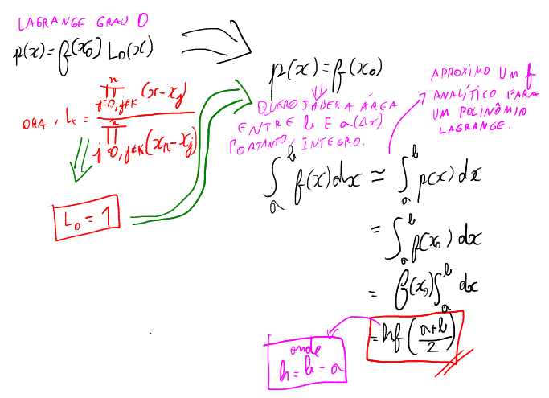

A representação de como funciona cada polinômio interpolador $P(x)$ para calcular a área de uma função funciona da seguinte forma:

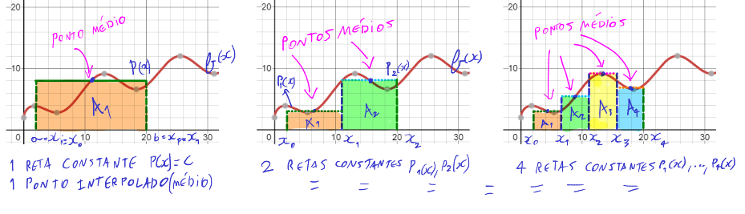

Integrando de $a = 2$ e $b = 20$ usando a fórmula do ponto médio, perceba que a cada iteração, ele subdivide em vários polinômios constantes (partições) usando o ponto médio da partição, até que cada vez mais fica próximo do formato da função $f$ original. Depois é só somar as áreas de cada retângulo para obter a área total da região. Quanto mais partições, mais preciso o resultado

Perceba o "base x altura". O ponto médio é a altura $f(a+b)/2$, e a base é o $b-a$, e isso é outra forma de provar a fórmula.

Essa é a **regra do meio** da Soma de Riemann. Existem duas outras filosofias (não muito comuns) que podem ser seguidas, mas apenas quando se trabalha com intervalos fechados, que é a **regra da esquerda** e a **regra da direita**.

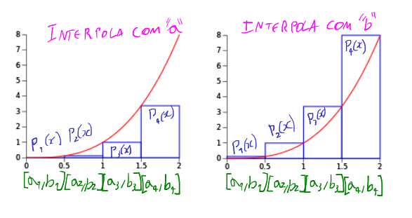

Os pontos $a$ de $P_1(x),...,P_4(x)$ interpolam $f$ (gráfico esquerdo) e os pontos $b$ de $P_1(x),...,P_4(x)$ interpolam $f$ (gráfico direito).

Suas fórmulas são as seguintes:

Regra da esquerda: $I = (b-a)\cdot f(a)$

Regra da direita: $I = (b-a)\cdot f(b)$

Perceba novamente a "base x altura" para as duas.

Tudo isso ficará muito mais claro na regra do trapézio, que é mais importante, tem uma aplicação muito parecida e é bem mais precisa.

## Grau 1 - Regra do Trapézio

A regra do trapézio consiste em usar interpolações aproximativas (seja de Newton ou Lagrange) para aproximar a um polinômio, de tal forma que a área de diversos trapézios somados formados por esses pontos interpolados em $f$ dê um resultado aproximado da integral (área total) da função $f$ em um intervalo de $a$ a $b$.

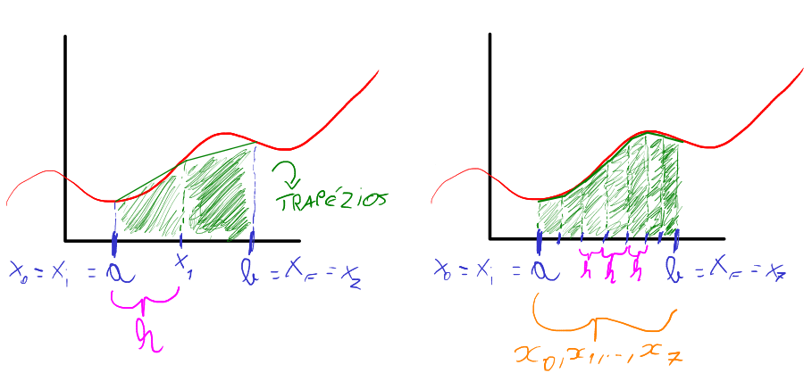

Perceba na figura que eu estou aplicando um método que cria uma divisão entre $a$ e $b$, e que isso me gera trapézios ao ligar pontos. Se eu fizer o cálculo de área dos trapézios na primeira figura $\frac{(Basemaior + basemenor)altura}{2}$ e somar as duas áreas, eu obtenho uma área aproximativa da função. Porém, perceba que foi feita somente uma divisão, com intervalo $\Delta x = h$ igualmente espaçados. E perceba que a aproximação é muito pobre, dado que foi feita somente uma divisão. Para melhorar os resultados, aplicamos mais divisões entre o intervalo $[a,b]$, com espaçamentos bem definidos $\Delta x = h$, e assim cada vez mais aproximamos o valor da área à função $f$ dentro do intervalo.

A regra do trapézio consiste na seguinte fórmula:

$$\Large I = \int_{a}^{b}f(x)dx \simeq \boxed{\frac{b-a}{2}\left(f(a)+f(b)\right)}$$

A demonstração pode ser utilizada tanto aproximando para um polinômio de Lagrange quanto pra um de Newton. Como já fiz de Lagrange pro grau 0, vou usar pra Newton dessa vez, mas pode ser feita pelas duas formas.

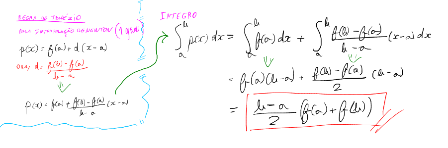

>Nota: para integrar a segunda expressão da figura, usa-se a regra do produto e da potência.

A partir de agora trabalharei com fórmulas simplificadas, pois os subequentes graus possuem um comportamento semelhante de expressão.

A fórmula simplificada é essa:

$$\Large I = \int_{a}^{b}f(x)dx \simeq \boxed{\frac{1}{2}h(f(x_0)+f(x_1))}$$

, onde $\boxed{h = \frac{b-a}{grau}}$, $\boxed{grau = 1}$, e $\boxed{x_i = a + i \cdot h}$

Aplicar somente uma vez em muitos casos não é suficiente. Por isso precisamos particionar o problema em diversos trapézios. com bases $h$, e quanto mais particionado e menor for $h$, mais preciso o resultado.

Fórmula alternativa

### Exemplo: integral de $2(\sqrt{x}+\cos \left(\frac{x}{2}\right))$ entre $a = 2$ e $b = 20$

Ainda pegando o exemplo da função de grau 0, a função tem esse comportamento:

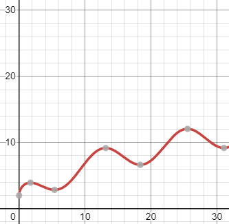

Pra obter a máxima precisão, precisamos particionar o problema diversas vezes, de tal forma que $h$ fique minúsculo e o mais próximo possível de zero. Quando isso ocorre, se temos uma tolerância a ser atingida de resultado em comparação ao resultado anterior, se for atingido, a aproximação numérica foi suficiente.

**Iteração $k = 1$**:

Começamos com 1 partição ($N = 1$) apenas, que é o próprio intervalo $[a,b]$ fechado. Ou seja, $h = b-a = 18$

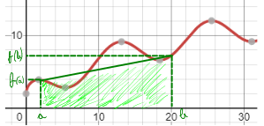

Sabendo que a soma é $I = \frac{b-a}{2}\left(f(a)+f(b)\right)$, substituindo os valores de $a,b,f(a),f(b)$ fica:

$A = I = \frac{b-a}{2}\left(f(a)+f(b)\right) \simeq 100.5764$

Se a tolerância for de $10^{-3}$, dá pra iterar muito mais, e normalmente no primeiro passo não sai um bom resultado. Portanto, precisa continuar aplicando o método. Mas como? Dobrando o número de partições sempre. O motivo explico depois.

**Iteração $k = 2$**:

Para $k = 2$, agora o número de partições $N$ são 2. Ou seja, separo em dois problemas e resolvo eles de forma individual. Pra particionar, basta eu dividir o $h = b-a$ pelo número de partições, sempre. Ai terei novos "h" menores do mesmo tamanho.

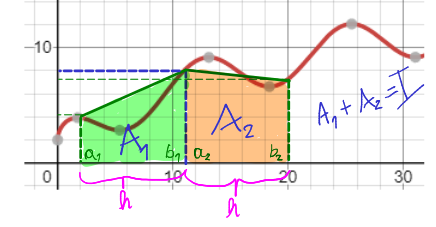

Observe que $b_1 = a_2$.

Fazendo para cada trapézio, fica:

$A_1+A_2 = \frac{b_1-a_1}{2}\left(f(a_1)+f(b_1)\right) + \frac{b_2-a_2}{2}\left(f(a_2)+f(b_2)\right)\simeq 122.7435$

Observe que o resultado converge para algum valor, mas ainda aparenta impreciso, principalmente porque do resultado anterior para o de agora, o erro foi consideravelmente alto.

**Iteração $k = 3$**:

Agora para o próximo passo $k = 3$, o número de partições $N$ são 4. O motivo de sempre multiplicarmos por 2 o número de partições, é para que todos os $h$ fiquem simétricos pela metade, buscando a simetria dos intervalos.

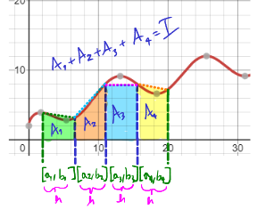

Perceba as diagonais do trapézio cada vez mais se aproximando de $f$ quanto mais partições são feitas. E por conta disso que teremos cada vez mais um resultado aproximado de área.

O cálculo é feito da mesma forma da segunda etapa.

$A_1+A_2+A_3+A_4 = \frac{b_1-a_1}{2}\left(f(a_1)+f(b_1)\right) + \frac{b_2-a_2}{2}\left(f(a_2)+f(b_2)\right)+ \frac{b_3-a_3}{2}\left(f(a_3)+f(b_3)\right)+ \frac{b_4-a_4}{2}\left(f(a_4)+f(b_4)\right)\simeq 111.7374$

**Iteração $k = 11$**:

Obviamente que a esse ponto, fazer na mão os cálculos é extremamente trabalhoso e inviável, e por isso recorremos a um algoritmo computacional. Mas a tabela completa da convergência é essa:

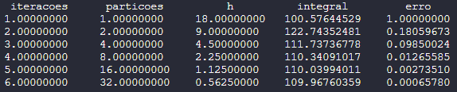

Perceba que a tolerância foi atingida, e é aí que o programa para. Ou seja, a área entre 2 e 20 é de aproximadamente 110, com um erro de $10^{-3}$ máximo.

E também é possível notar que em $k = 1$ para $k = 2$, a área total sobe e depois disso ela declina. Nas figuras que apresentei aproximativas do gráfico, é possível que sim, o trapézio pode ter uma área menor, depois ao aproximar por mais trapézios, ela aumenta, e depois diminui novamente. Isso é visível a olho nu nas figuras, e é comum ocorrer quando se tem um intervalo $[a,b] = \Delta x$ cobrindo parábolas e pontos de inflexão, como dessa função $f$.

O algoritmo é esse:

```python
import math
import numpy as np


def f(x):
    return 2*(math.sqrt(x)+np.cos(x/2))


def newton_cotes_grau1_fechada(a, b, tol=1e-3):
    # Indexação
    print("{:^15}{:^15}{:^15}{:^15}{:^15}".format(
        "iteracoes", "particoes", "h", "integral", "erro"))

    # Trabalho de início apenas com 1 partição, o próprio intervalo [a,b]
    particoes = 1
    # Primeira iteração
    k = 1

    # Intervalo h de cada partição do conjunto de partições
    h = (b-a)/particoes

    # Integral
    soma = ((b-a)/2)*(f(a)+f(b))
    soma_anterior = 0  # Valor necessário pra verificar a tolerância
    soma_atual = soma  # E fazer a subtração desse com o anterior
    erro = abs((soma_atual-soma_anterior)/soma_atual)  # Erro

    # Formatação das iterações
    print("{:^15.8f}{:^15.8f}{:^15.8f}{:^15.8f}{:^15.8f}".format(
        k, particoes, h, soma_atual, erro))

    if erro < tol:  # Se já atingiu a tolerância, o programa para
        return soma_atual

    # Aumento as partições
    particoes = 2
    converge = True

    # Aqui começa o método iterativo, refazendo todo o cálculo com novas divisões para partições
    while converge:
        soma = 0

        k = k + 1  # Segunda, terceira, quarta iteração...
        h = (b-a)/particoes

        for particao in range(particoes):
            x_inicial = a+particao*h  # Defino um "a" e "b" novo para cada partição. O "a" é baseado em quantos "h" foram andados.
            x_final = x_inicial+h

            # Fórmula do grau 1 fechada
            soma = soma + ((x_final-x_inicial)/2)*(f(x_inicial)+f(x_final))

        # Feita a soma, guardo o valor anterior e capturo esse novo valor
        soma_anterior = soma_atual
        soma_atual = soma
        erro = abs((soma_atual-soma_anterior)/soma_atual)

        print("{:^15.8f}{:^15.8f}{:^15.8f}{:^15.8f}{:^15.8f}".format(
            k, particoes, h, soma_atual, erro))

        if erro < tol:
            return soma_atual

        # Multiplico as partições por 2, pois assim corto pela metade cada vez mais o h, procurando manter a simetria dos intervalos
        particoes *= 2
```

## Grau 2 - Regra de Simpson 1/3

A regra de Simpsion 1/3 é chamada dessa forma por conta de sua fórmula:

$$\Large I = \int_{a}^{b}f(x)dx \simeq = \boxed{\frac{1}{3}h[f(x_1) + 4f(x_2) + f(x_3)]}$$

, onde,  $\boxed{h = \frac{b-a}{grau}}$, $\boxed{grau = 2}$, e $\boxed{x_i = a + i \cdot h}$

Ou seja, é chamada de $1/3O pois o $h$ multiplica por $\frac{1}{3}$ na fórmula principal.

A demonstração da fórmula é longa, porém é igual a demonstração do trapézio. Basta escolher um polinômio aproximativo, seja de Newton ou Lagrange, que é interpolado por 3 pontos, e como consequência é expandido até o segundo grau, e ao integrar no intervalo $[a,b]$ em cima desse polinômio, obtem-se a fórmula.

A regra de 1/3 de Simpson busca criar parábolas sobre $f$ ao invés de trapézios, de tal forma que a cada partição, novas parábolas internas e pontos de inflexão em cima de extremos dos intervalos fechados surgem, e cada vez mais se torna aproximativo ao $f$ conforme mais iterações são feitas.

Peguemos o exemplo da função crescente trigonométrica anterior:

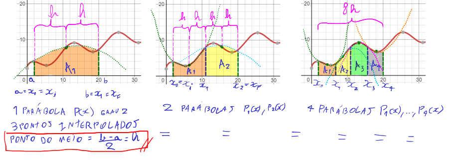

A cada iteração e mais partições, tenho mais parábolas, até que chega em um momento onde elas estarão tão aproximadas da $f$ que, dependendo do erro, obtenho um resultado favorável de área.

A parábola obrigatoriamente deve interpolar 3 pontos de $f$. Ou seja, a cada partição, são gerados polinômios diferentes interpoladores de grau 2 (parábolas) que interpola 3 pontos de cada partição em $f$. E assim calculo a área para cada parábola dessa dentro desses pequenos intervalos $[a,b]$ novos formados. Cada intervalo $[a,b]$ é um $x_1-x_0$, $x_2-x1$, e assim sucessivamente, ou seja, são as partições basicamente.

O ponto verde no meio é justamente $\frac{b-a}{2} = h$, e por isso que entre uma interpolação e outra, temos uma distância $h$. Na regra do trapézio, $h$ existia, mas era dividido por 1, e por isso não aparecia de forma evidente na fórmula, mas ela está lá. Afinal, na regra do trapézio só trabalhando com dois pontos interpolados, o que significa que o $h$ é o próprio intervalo de partição de um ponto interpolador a outro.

Existem momentos onde a parábola fica mais acima da $f$, enquanto outras ficam mais embaixo da $f$, e isso nem sempre é ruim, pois muitas vezes compensa perdas e ganhos de parábolas anteriores, que ou ultrapassaram demais, ou ficaram abaixo demais, e isso ajuda a coincidir com uma aproximação da área de $f$ no intervalo $[a,b]$

Em python, basta pegar o código do trapézio, acrescentar o $h$, e substituir a variável $soma$.

```python
# primeira iteração
h = (b-a)/2
soma = (h)/3*(f(a) + 4*f(a+h) + f(a+2*h))
...
# k-ésima iteração (laço while)
h = (x_final-x_inicial)/2
soma = soma + (h)/3*(f(x_inicial) + 4*f(x_inicial+h) + f(x_inicial+2*h))
```

## Grau 3 - Regra de Simpson 3/8

A regra de Simpson 3/8 segue exatamente a mesma lógica da demonstração de 1/3, e os subsequentes graus também. Surge a partir de uma aproximação de polinômio de grau 3, interpolando 4 pontos.

A fórmula é a seguinte:

$$\Large I = \int_{a}^{b}f(x)dx \simeq = \boxed{\frac{3}{8}h[f(x_0) + 3f(x_1) + 3f(x_2) +f(x_3)]}$$

, onde $\boxed{h = \frac{b-a}{grau}}$, $\boxed{grau = 3}$, e $\boxed{x_i = a + i \cdot h}$

O nome $3/8$ é porque $h$ multiplica por $\frac{3}{8}$ na fórmula principal.

E justamente por causa disso, temos 4 pontos interpolados em $f$ pelo polinômio interpolador que formam uma curv cúbica. Ou seja, ao invés de trabalhar com parábola, trabalharemos com curvas cúbicas, e a cada curva cúbica interpolando uma partição de $f$, teremos 3 "h"s.

Em python, basta alterar a fórmula da soma, e dessa vez particionar em 3 vezes.

```python
# primeira iteração
h = (b-a)/3
soma = (3*(h)/8)*(f(a) + 3*F(a+h) + 3*F(a+2*h) +F(a+3*h))
...
# k-ésima iteração (laço while)
h = (x_final-x_inicial)/3
soma = soma + (3*(h)/8)*(f(x_inicial) + 3*F(x_inicial+h) + 3*F(x_inicial+2*h) +F(x_inicial+3*h))

# Partições
particoes *= 3
```

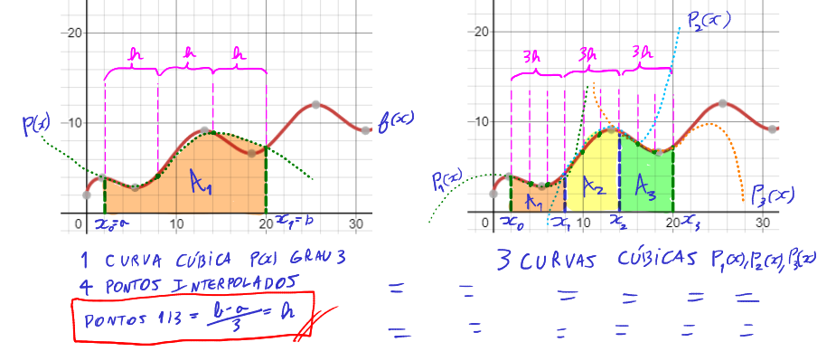

Esse método tem uma particularidade, que é a precisão maior para casos com muitos pontos de inflexão, e quando há muita oscilação em $f$ em um intervalo $[a,b]$, porém não é adequado o uso para quantidade de pontos pares que separam os intervalos de integração. Ou seja, o método trabalha com quantidade ímpares de pontos, ao invés de pares (trapézio e 1/3 Simpson utilizam quantidades pares).

## Grau 4 - Regra de Boole

A regra de Boole é basicamente uma 1/3 Simpson extendida. A sua fórmula é:

$$\Large I = \int_{a}^{b}f(x)dx \simeq \boxed{\frac{2}{45}h[7f(x_0) + 32f(x_1) + 12f(x_2) +32f(x_3)+7f(x_4)]}$$

, onde $\boxed{h = \frac{b-a}{grau}}$, $\boxed{grau = 4}$, e $\boxed{x_i = a + i \cdot h}$

No programa, basta alterar essas variáveis:

```python
# primeira iteração
h = (b-a)/4
soma = (2*(h)/45)*(7*f(a) + 32*f(a+h) + 12*f(a+2*h) +32*f(a+3*h)+7*f(a+4*h))
...
# k-ésima iteração (laço while)
h = (x_final-x_inicial)/4
soma = soma + (2*(h)/45)*(7*f(x_inicial) + 32*f(x_inicial+h) + 12*f(x_inicial+2*h) +32*f(x_inicial+3*h)+7*f(x_inicial+4*h))

# Partições
particoes *= 4
```

# Filosofia Aberta

Na filosofia aberta, busca-se integrar $f(x)$ em um intervalo aberto $(a,b)$. O seu uso é pouco comum, mas quando se tem pontos de singularidade (tendendo a algum valor, mas nunca exatamente nele) em $a$ ou $b$ na função $f$, ou quando temos descontinuidade (quebra da função repentina), e nessa descontinuidade poderia estar localizado $a$ ou $b$, usamos a filosofia aberta de Newton-Cotes.

## Grau 0 - Soma de Riemann aberta (ou regra do ponto médio aberta)

A fórmula é a seguinte:

$$\Large I = \int_{a}^{b}f(x)dx \simeq \boxed{2hf(x_0) = (b-a)[f((a+b)/2)]}$$

, onde $\boxed{h = \frac{b-a}{grau+2}}$, $\boxed{grau = 0}$, e $\boxed{x_i = a + (i+1) \cdot h}$.

A fórmula é exatamente a mesma, pois usa a regra do meio (ponto médio). São retângulos formados por polinômios interpoladores constantes, que intersectam ao ponto médio de uma partição de $f$. Porém, dessa vez não pode usar os intervalos $a$ e $b$ como interpoladores. Ou seja, a regra só se aplica a intervalos abertos, não podendo usar a regra da direita nem esquerda da filosofia fechada.

## Grau 1 - Regra do Trapézio Aberta

A fórmula é a seguinte:

$$\Large I = \int_{a}^{b}f(x)dx \simeq \boxed{\frac{3}{2}h(f(x_0) + f(x_1))}$$

, onde $\boxed{h = \frac{b-a}{grau+2}}$, $\boxed{grau = 1}$, e $\boxed{x_i = a + (i+1) \cdot h}$.

## Grau 2 - Regra de Milne

A fórmula é a seguinte:

$$\Large I = \int_{a}^{b}f(x)dx \simeq \boxed{\frac{4}{3}h(2f(x_0) - f(x_1)+2f(x_2))}$$

, onde $\boxed{h = \frac{b-a}{grau+2}}$, $\boxed{grau = 2}$, e $\boxed{x_i = a + (i+1) \cdot h}$.

## Grau 3 - Sem nome especial

A fórmula é a seguinte:

$$\Large I = \int_{a}^{b}f(x)dx \simeq \boxed{\frac{5}{24}h(11f(x_0) + f(x_1) + f(x_2) + 11f(x_3))}$$

, onde $\boxed{h = \frac{b-a}{grau+2}}$, $\boxed{grau = 3}$, e $\boxed{x_i = a + (i+1) \cdot h}$.

## Grau 4 - Sem nome especial

A fórmula é a seguinte:

$$\Large I = \int_{a}^{b}f(x)dx \simeq \boxed{\frac{6}{20}h(11f(x_0) - 14f(x_1) + 26f(x_2) - 14f(x_3)+11f(x_4))}$$

, onde $\boxed{h = \frac{b-a}{grau+2}}$, $\boxed{grau = 4}$, e $\boxed{x_i = a + (i+1) \cdot h}$.

# Termo do Erro

O erro existe porque a técnica de aproximação de polinômios assume que a função a ser integrada é constante em cada intervalo de integração. No entanto, na prática, a função pode ter variações significativas em cada intervalo, o que faz com que a aproximação por polinômios não seja exata.

O erro em Newton-Cotes pode ser calculado utilizando fórmulas matemáticas específicas para cada técnica de integração numérica. Essas fórmulas levam em conta o número de pontos de integração, o grau do polinômio de aproximação e outras características da função a ser integrada. Também pode ser utilizado para comparar diferentes técnicas de integração numérica e determinar qual delas é mais precisa para uma determinada função e intervalo de integração.

Vou dar um exemplo da fórmula de erro para o trapézio:

$$-\frac{1}{12}h^3f^{(2)}(\xi)$$

Essa fórmula nos diz que o erro de aproximação da integral utilizando o método do trapézio é proporcional a h^3, ou seja, o erro diminui à medida que o tamanho do intervalo de integração é reduzido. Além disso, o erro é proporcional à segunda derivada da função $f(x)$, ou seja, quanto mais "curvada" a função for, maior será o erro. Por fim, o valor de $\xi$ não é conhecido, mas deve estar dentro do intervalo de integração e é utilizado para indicar que o erro é uma aproximação.

Para aplicar essa fórmula, primeiro é preciso calcular a segunda derivada contínua da função $f(x)$ e determinar o tamanho do intervalo de integração $h$. Em seguida, deve-se encontrar um valor para $\xi$ que esteja dentro do intervalo de integração. Esse valor pode ser encontrado utilizando métodos numéricos, como o método da bissecção ou o método de Newton. Finalmente, basta substituir esses valores na fórmula do erro para obter uma estimativa do erro de aproximação da integral utilizando o método do trapézio.

Essa estimativa do erro pode ser utilizada para determinar o número de subintervalos necessários para obter uma aproximação precisa da integral ou para comparar diferentes métodos de integração numérica e escolher o mais adequado para a função em questão.

# Tabelas-Resumo

Essas tabelas podem ser muito úteis para resumir tudo que foi falado até agora.

### Newton-Cotes Fechado

Para $0 \le i \le grau$, seja:

$x_i = (i)\cdot h$

, e $h = \frac{b-a}{grau}$, exceto se $grau = 0 \implies h = \frac{(b-a)}{1}$.

| Grau | h | Nome | Fórmula | Erro |
| --- | --- | --- | --- | --- |
| 0 | $\frac{(b-a)}{1}$ | Soma de Riemann | $2hf(x_0)$ | - |
| 1 | $\frac{(b-a)}{1}$ | Regra do Trapézio | $\frac{1}{2}h(f(x_0)+f(x_1))$ | $-\frac{1}{12}h^3f^{(2)}(\xi)$ |
| 2 | $\frac{(b-a)}{2}$ | Regra 1/3 de Simpson | $\frac{1}{3}h[f(x_1) + 4f(x_2) + f(x_3)]$ | $-\frac{1}{90}h^5f^{(4)}(\xi)$ |
| 3 | $\frac{(b-a)}{3}$ | Regra 3/8 de Simpson | $\frac{3}{8}h[f(x_0) + 3f(x_1) + 3f(x_2) +f(x_3)]$ | $-\frac{3}{80}h^5f^{(4)}(\xi)$ |
| 4 | $\frac{(b-a)}{4}$ | Regra de Boole | $\frac{2}{45}h[7f(x_0) + 32f(x_1) + 12f(x_2) +32f(x_3)+7f(x_4)]$ | $-\frac{8}{945}h^7f^{(6)}(\xi)$ |


### Newton-Cotes Aberto

Para $0 \le i \le grau$, seja:

$x_i = (i+1)\cdot h$

, e $h = \frac{b-a}{grau+2}$.

| Grau | h | Nome | Fórmula | Erro |
| --- | --- | --- | --- | --- |
| 0 | $\frac{(b-a)}{2}$ | Soma de Riemann Aberta | $2hf(x_0)$ | $\frac{1}{3}h^3f^{(2)}(\xi)$ |
| 1 | $\frac{(b-a)}{3}$ | Regra do Trapézio Aberta | $\frac{3}{2}h(f(x_0) + f(x_1))$ | $\frac{3}{4}h^3f^{(2)}(\xi)$ |
| 2 | $\frac{(b-a)}{4}$ | Regra de Milne | $\frac{4}{3}h(2f(x_0) - f(x_1)+2f(x_2))$ | $\frac{14}{45}h^5f^{(4)}(\xi)$ |
| 3 | $\frac{(b-a)}{5}$ | Sem Nome | $\frac{5}{24}h(11f(x_0) + f(x_1) + f(x_2) + 11f(x_3))$ | $\frac{95}{144}h^5f^{(4)}(\xi)$ |
| 4 | $\frac{(b-a)}{6}$ | Sem Nome | $\frac{6}{20}h(11f(x_0) - 14f(x_1) + 26f(x_2) - 14f(x_3)+11f(x_4))$ | $\frac{1}{2880}h^7f^{(5)}(\xi)$ |