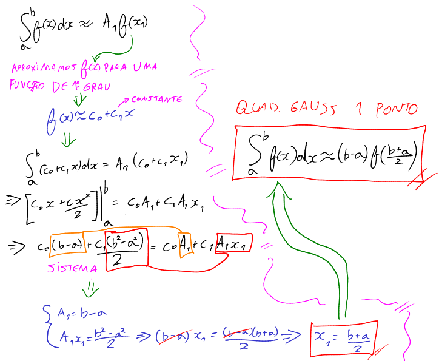
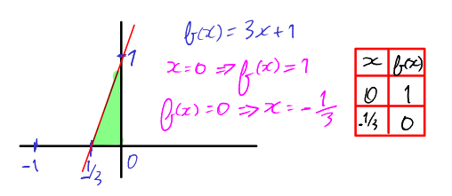
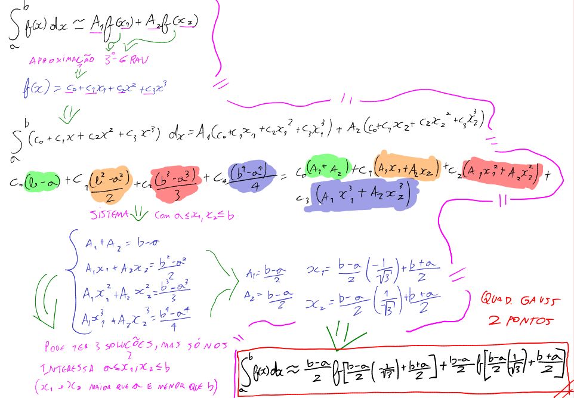
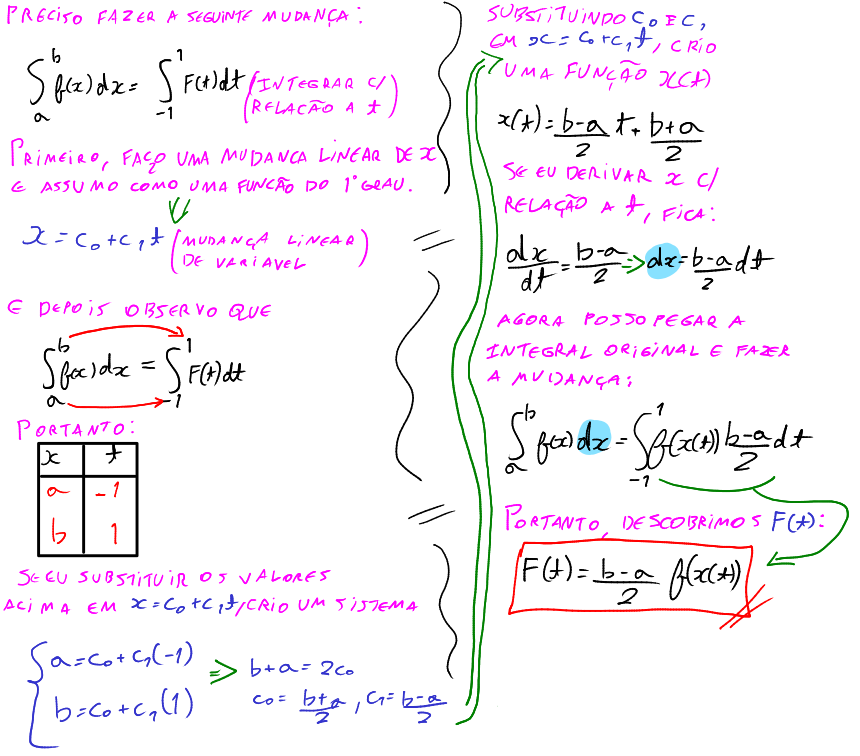
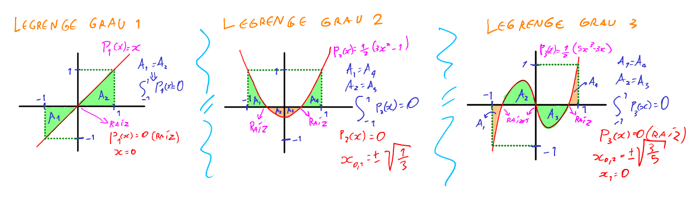
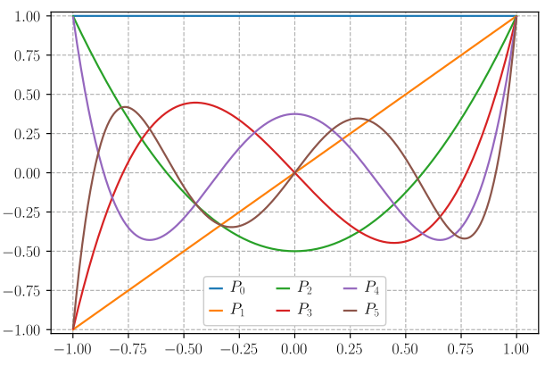

# Quadratura de Gauss

O método de Gauss e de Gauss-Legendre para Integração Numérica consiste em aproximar o valor de uma integral definida sobre um polinômio. O número de pontos escolhidos será igual ao grau do polinômio para aproximação, e são conhecidos como nós de integração. Em seguida, são calculados os pesos para cada nó, que são usados pra ponderar as contribuições dos valores da função integranda em cada nó.

O método garante que se a função a ser integrada for suficientemente suave, e o número de nós de integração for grande, a aproximação da integral será precisa.

Esse método numérico é útil para integrar funções que não podem ser resolvidas analiticamente.

# Quadratura de Gauss

Existem várias quadraturas de vários pontos. Não vou estender muito sobre a quantidade de pontos, e por isso irei apresentar apenas os pontos 1 e 2.

## Regra de 1 ponto

A quadratura de Gauss utilizando 1 ponto é a seguinte:

$$\Large I = \int_{a}^{b}f(x)dx \simeq \boxed{A_1f(x_1) = (b-a)f((b-a)/2)}$$

, onde $A_1$ é uma constante qualquer definida por: $$

$A_1$ multiplica $f(x_1)$. É também chamada de **peso**. $x_1$ é o único ponto que estamos trabalhando.

A demonstração dessa fórmula é a seguinte:



### Exemplo: calcular a área entre -1/3 e 0 de $f(x) = 3x + 1$ usando "base x altura", integração analítica e quadratura de gauss.

Fazemos o esborço básico do gráfico



Solução base x altura: $Area = (\frac{1}{3}\cdot 1)\frac{1}{2} = \boxed{\frac{1}{6}}$

Solução integração analítica: $\int_{-1/3}^{0}(3x+1)dx = \left[\frac{3x^2}{2}+x\right]_{-1/3}^0 = \boxed{\frac{1}{6}}$

Solução quadratura de Gauss: $(b-a)f((b-a)/2) = (0-(-\frac{1}{3}))f(\frac{0+(-\frac{1}{3})}{2}) = \boxed{\frac{1}{6}}$

### Observação importante: Pré Gauss-Legendre

Como um pré Gauss-Legendre, se integrarmos $f(x)$ em um intervalo $[a,b] = [1,-1]$, fica:

$\int_{-1}^{1}f(x)dx \simeq A_1f(x_1) = (b-a)f((b-a)/2)$

$= (1-(-1))f(1+(-1)/2) = 2f(0)$

Comparando o resultado $2f(0)$ com $A_1f(x_1)$, isso implica que $A_1 = 2$ e $x_1 = 0$. Esses valores são os valores utilizados na quadratura de Gauss-Legendre. A ideia é sempre transformar a integral de Gauss ($a$ até $b$) em uma integral de Gauss-Legendre (-1 a 1).

## Regra de 2 pontos

A regra de 2 pontos consiste no seguinte:

$$\Large I = \int_{a}^{b}f(x)dx \simeq \boxed{A_1f(x_1)+A_2f(x_2) = \frac{b-a}{2}f\left[\frac{b-a}{2}\left(-\frac{1}{\sqrt{3}}\right)+\frac{b+a}{2}\right]+\frac{b-a}{2}f\left[\frac{b-a}{2}\left(\frac{1}{\sqrt{3}}\right)+\frac{b+a}{2}\right]}$$

Agora temos 2 pontos $x_1$ e $x_2$. Ou seja, temos 4 variáveis $A_1, x_1, A_2, x_2$, e para isso precisa de 4 equações para um sistema linear.

Demonstração:



### Observação importante: Pré Gauss-Legendre

Mesma coisa do 1 ponto, se integrarmos $f(x)$ em un intervalo $[a,b] = [1,-1]$, fica:

$\int_{-1}^{1}f(x)dx \simeq A_1f(x_1) + A_2f(x_2) = $

$= \frac{b-a}{2}f\left[\frac{b-a}{2}\left(-\frac{1}{\sqrt{3}}\right)+\frac{b+a}{2}\right]+\frac{b-a}{2}f\left[\frac{b-a}{2}\left(\frac{1}{\sqrt{3}}\right)+\frac{b+a}{2}\right]$

Substituindo $a$ e $b$ por -1 e 1, respectivamente e resolvendo todas as operações básicas, temos:

$\int_{-1}^{1}f(x)dx \simeq 1\cdot f\left(\frac{-1}{\sqrt{3}}\right) + 1\cdot f\left(\frac{1}{\sqrt{3}}\right)$

Esses valores serão também utilizados em Gauss-Legendre.

# Quadratura de Gauss-Legendre - Introdução

Perceba que a cada ponto que adiciono na quadratura de Gauss, as fórmulas vão ficando extremamente grandes

1 ponto ($x_1$): $\int_{a}^{b}f(x)dx \simeq (b-a)f\left(\frac{(b-a)}{2}\right)$

2 pontos ($x_1, x_2$): $\int_{a}^{b}f(x)dx \simeq \frac{b-a}{2}f\left[\frac{b-a}{2}\left(-\frac{1}{\sqrt{3}}\right)+\frac{b+a}{2}\right]+\frac{b-a}{2}f\left[\frac{b-a}{2}\left(\frac{1}{\sqrt{3}}\right)+\frac{b+a}{2}\right]$

Com 3 pontos, provavelmente já seria uma fórmula bem chata de se trabalhar, fora que para encontrar $A_1, x_1, A_2, x_2, A_3, x_3,...,A_n,x_n$ seria muito trampo.

Precisamos encontrar uma maneira de fazer uma integral equivalente a $\int_{a}^{b}f(x)dx$.

Pra isso, trabalhamos com uma integral que tem exatamente o mesmo valor, mas dessa vez ela tem limites de integração de -1 a 1, e no lugar de $f(x)$, assumimos um $F$ que não sabemos ainda (vamos descobrir), e que muda em função de um $t$. Assim:

$$\int_{a}^{b}f(x)dx = \int_{-1}^{1}F(t)dt$$

Nesse momento estou interessado em saber o que é $F(t)$, como acho ele e como essa conversão deve ser feita. 

Temos essas duas expressões de pontos acima simplificadas para:

1 ponto: $(b-a)f\left(\frac{(b-a)}{2}\right) = \boxed{2f(0)\cdot constante}$

2 pontos: $\frac{b-a}{2}f\left[\frac{b-a}{2}\left(-\frac{1}{\sqrt{3}}\right)+\frac{b+a}{2}\right]+\frac{b-a}{2}f\left[\frac{b-a}{2}\left(\frac{1}{\sqrt{3}}\right)+\frac{b+a}{2}\right] = \boxed{f\left(\frac{-1}{\sqrt{3}}\right)+f\left(\frac{1}{\sqrt{3}}\right)\cdot constante}$

A constante é necessária pois estamos mudando os limites de integração.

### Demonstração

Nesse momento preciso mudar minha integral, que é em relação a $x$, para ser em relação a $t$. Para isso, faço uma mudança linear.



Ou seja, chegamos na fórmula desejada:

$$\Large I = \int_{a}^{b}f(x)dx = \boxed{\int_{-1}^{1}f(x(t))\frac{b-a}{2}dt}$$

, onde $\boxed{x(t) = \frac{b-a}{2}t + \frac{b+a}{2}}$

### Exemplo: calcular $\int_{2}^{10}x^2dx$ usando a técnica de mudança de variável

**Solução analítica:**

$\int_{2}^{10}x^2dx = \left[\frac{x^3}{3}\right]_2^10 = \frac{10^3-2^3}{3} = 330.67$

**Solução numérica:**

Para começar a mudança de variável, preciso descobrir $x(t)$.

$x(t) = \frac{b-a}{2}t+\frac{b+a}{2} = 4t+6$

Derivo $x(t)$:

$\frac{dx(t)}{dt} = 4 \implies dx = 4dt$

Sabendo o valor de $x(t)$ e $dx$, agora faço a mudança de integral:

$\int_{2}^{10}x^2dx = \int_{-1}^{1}(4t+6)^2\cdot 4dt $

$= 4\int_{-1}^{1}(4t+6)^2dt$

$= 4\left(\frac{16(1^3-(-1)^3)}{3}+\frac{48(1^2-(-1)^2)}{2}+36(1-(-1))\right)$

$= 330.67$


# Polinômio de Legendre

Um polinômio de Legendre é um caso especial de polinômio, semelhante ao polinômio de Newton e Lagrange, mas ele tem uma particularidade.

A cada grau, ele trabalha com fórmulas bem definidas.

Voltando as regras de pontos: e se eu quisesse uma regra de três pontos $\int_{a}^{b}f(x)dx \simeq A_1f(x_1)+A_2f(x_2)+A_3(x_3)$?

O sistema ficaria mais ou menos assim:

$$\Large\left\{ \begin{array}{cl}
A_1 + A_2 + A_3 & = b-a \\
A_1x_1 + A_2x_2 + A_3x_3 & = \frac{b^2 - a^2}{2} \\
A_1x_1^2 + A_2x_2^2 + A_3x_3^2 & = \frac{b^3-a^3}{3} \\
A_1x_1^3 + A_2x_2^3 + A_3x_3^3 & = \frac{b^4-a^4}{4}\\
A_1x_1^4 + A_2x_2^4 + A_3x_3^4 & = \frac{b^5-a^5}{5}\\
... & ...\\
\end{array} \right.$$

Bem longo. Até porque sabendo que quanto mais expandimos $\int_{a}^{b}f(x)dx \simeq A_1f(x_1)+A_2f(x_2)+...+A_n(x_n)$, mais complexo fica o sistema linear.

Nesse caso da regra dos três pontos, poderíamos ainda simplificar, substituindo $a = -1$  e $b = 1$, ficando:

$$\Large\left\{ \begin{array}{cl}
A_1 + A_2 + A_3 & = 2\\
A_1x_1 + A_2x_2 + A_3x_3 & = 0 \\
A_1x_1^2 + A_2x_2^2 + A_3x_3^2 & = 2/3 \\
A_1x_1^3 + A_2x_2^3 + A_3x_3^3 & = 0 \\
A_1x_1^4 + A_2x_2^4 + A_3x_3^4 & = 2/5 \\
... & ...\\
\end{array} \right.$$

Irei deixar esse sistema de molho por enquanto, pois será muito importante já já, pois irei falar sobre outra coisa agora.

Um recurso que a gente pode usar são os **Polinômios de Legendre**.

A fórmula do polinômio é a seguinte:

$$\Large \boxed{P_n(x) = \frac{1}{2^nn!}\frac{d^n}{dx^n}[(x^2-1)^n]}$$

A demonstração dessa fórmula é extremamente complexa, originada de uma solução de uma equação diferencial da física quântica para estudos microscópicos de partículas subatômicas, e por isso não irei demonstrar aqui. Porém, vamos assumir que esse teorema é provado e já demonstrado previamente.

Se pegarmos exemplos de grau 0 até 3, temos:

Grau 0: $P_0(x) = \frac{1}{2^00!}\frac{d^0}{dx^0}[(a^2-1)^0] = 1$

Grau 1: $P_1(x) = \frac{1}{2^11!}\frac{d^1}{dx^1}[(a^2-1)^1] = x$

Grau 2: $P_2(x) = \frac{1}{2^22!}\frac{d^2}{dx^2}[(a^2-1)^2] = \frac{1}{2}(3x^2-1)$

Grau 3: $P_3(x) = \frac{1}{2^33!}\frac{d^3}{dx^3}[(a^2-1)^3] = \frac{1}{2}(5x^3-3x)$

A tabela completa para cada grau é essa:

| $n$ (grau) | $P_n(x)$ |
| --- | --- |
| $0$ | $1$ |
| $1$ | $x$ |
| $2$ | $\frac{1}{2}(3x^2-1)$ |
| $3$ | $\frac{1}{2}(5x^3-3x)$ |
| $4$ | $\frac{1}{8}(35x^4-30x^2+3)$ |
| $5$ | $\frac{1}{8}(63x^5-70x^3+15x)$ |
| $6$ | $\frac{1}{16}(231x^6-315x^4+105x^2-5)$ |
| $7$ | $\frac{1}{16}(429x^7-693x^5+315x^3-35x)$ |
| $8$ | $\frac{1}{128}(6435x^8-12012x^6+6930x^4-1260x^2+35)$ |
| $9$ | $\frac{1}{128}(12155x^9-25740x^7+18018x^5-4620x^3+315x)$ |
| $10$ | $\frac{1}{256}(46189x^{10}-109395x^8+90090x^6-30030x^4+3465x^2-63)$ |

Algumas propriedades (para $n>0$) e seja $Q_k$ um polinômio qualquer de grau $k$, com $k < n$ (ou seja, o grau de $Q$ precisa ser menor que de $P$):

| Propriedade | Descrição |
| --- | --- |
| $P_n(1) = 1$ | Qualquer Legendre com $x = 1$ é 1. |
| $P_n(-1) = (-1)^n$ | Qualquer Legendre com $x = 1$ é $(-1)^n$ |
| $\int_{-1}^{1}P_n(x)dx = 0$ | A integral de -1 a 1 de um Legendre é 0. |
| $\int_{-1}^{1}P_n(x)\cdot Q_k(x)dx = 0$ tal que $k < n$ | A integral de -1 a 1 de um produto de Legendre com um Polinômio $Q$ qualquer é zero*.

>Nota: *Somente se $k < n$.

>Nota2: Essa última propriedade $\int_{-1}^{1}P_n(x)\cdot Q_k(x)dx = 0$ é absolutamente importante para definir a Quadratura de Gauss-Legendre mais tarde.

Os gráficos desses polinômios (até n = grau 3) são mostrado abaixo:



Perceba na figura, que na parábola, ela não passa pela origem 0. Na verdade, graus pares não passam pela origem de jeito nenhum. Perceba por essa imagem, onde vai até grau 5 (extraido da Wikipédia):



## Raízes do Polinômio de Legendre

As raízes do polinômio $P_i(x)$ são os valores quando $P_i(x) = 0$, para $i = 0,1...n$.

- Todas as raízes são distintas;
- Todas as raízes estão no intervalo aberto (-1, 1);
- Cada raíz $x_i$ tem sua correspondente simétrica $x_i$.

Ou seja, um polinômio de Legendre de grau $n$ tem $n$ raízes diferentes situadas, simetricamente, entre -1 e 1.

Exemplo:

Grau 0: $P_0(x) = 1$ (constante)

Grau 1: $P_1(x) = x = 0 \implies x = 0$

Grau 2: $P_2(x) = \frac{1}{2}(3x^2-1) = 0 \implies x = \pm \sqrt{\frac{1}{3}}$

Grau 3: $P_3(x) = \frac{1}{2}(5x^3-3x) = 0 \implies x_1 = -\sqrt{\frac{3}{5}}, x_2 = 0, x_3 = +\sqrt{\frac{3}{5}}$

E por aí vai.

# Quadratura de Gauss-Legendre - Definitivo

Até agora trabalhamos com algumas fórmulas e que disse que iria usar para agora. Irei trazer elas para cá.

Perceba um padrão nas regras do 1 ponto e dos 2 pontos:

EXPRESSÃO 1: $\boxed{I = \int_{a}^{b}f(x)dx \simeq A_1f(x_1) = (b-a)f\left(\frac{b-a}{2}\right)}$

EXPRESSÃO 2: $\boxed{I = \int_{a}^{b}f(x)dx \simeq A_1f(x_1)+A_2f(x_2) = \frac{b-a}{2}f\left[\frac{b-a}{2}\left(-\frac{1}{\sqrt{3}}\right)+\frac{b+a}{2}\right]+\frac{b-a}{2}f\left[\frac{b-a}{2}\left(\frac{1}{\sqrt{3}}\right)+\frac{b+a}{2}\right]}$

Agora perceba a regra da mudança de variável:

EXPRESSÃO 3: $\boxed{\int_{-1}^{1}\frac{b-a}{2}f(x(t))dt}$, com $\boxed{x(t) = \frac{b-a}{2}t + \frac{b+a}{2}}$,

Veja que há a possibilidade de uma equivalência entre a Expressão 3, 1 e 2.

Podemos dizer que $x(t)$ da Expressão 3 está para o que tem dentro de $f$ na Expressão 2 e 1, com $t$ sendo as raízes do polinômio de Legendre.

Perceba também que a cada ponto a mais, elas seguem um padrão de somatório.

E portanto, a fórmula geral do método de Gauss-Legendre é essa:

$$\Large I = \int_{a}^{b}f(x)dx \simeq \boxed{\frac{b-a}{2}[\sum_{k = 1}^{n}f(x(t_k))A_k]}$$

, onde:

- $\boxed{x(t_k) = \frac{a+b}{2}+\frac{b-a}{2}t_k}$;

- $t_k$, com $k = 1,2,...,n$ são as raízes constantes do polinômio $P_n(x)$ de Legendre de grau $n$;

- $A_k$, com $k = 1,2,...,n$ são os pesos constantes correspondentes dados por $A_k = \int_{-1}^{1}L_k(t)dt$, com $L$ sendo um polinômio de Lagrange.


Agora irei mudar alguns nomes de variáveis de tal forma que seja compatível com a abordagem do professor Creto:

As mudanças foram as seguintes:
- $b \implies x_f$
- $a \implies x_i$
- $t \implies a$
- $A \implies w$
- $f \implies p$

Resultando em:

$$\Large I = \int_{x_i}^{x_f}f(x)dx \simeq \boxed{\frac{x_f-x_i}{2}[\sum_{k = 1}^{n}p(x(a_k))w_k]}$$

, onde:

- $\boxed{x(a_k) = \frac{x_i+x_f}{2}+\frac{x_f-x_i}{2}a_k}$;

- $a_k$, com $k = 1,2,...,n$ são as raízes constantes do polinômio $P_n(x)$ de Legendre de grau $n$;

- $w_k$, com $k = 1,2,...,n$ são os pesos constantes correspondentes dados por $w_k = \int_{-1}^{1}L_k(a)da$, com $L$ sendo um polinômio de Lagrange.

Segue a tabela completa de raízes e pesos, de grau 0 até 4 do método de Gauss-Legendre:

| $n$ (grau) | Raízes | Pesos |
| --- | --- | --- |
| $0$ | Não possui raízes reais | 0 |
| $1$ | $0$ | $w_1 = 1$ |
| $2$ | $\pm\sqrt{\frac{1}{3}}$ | $w_1 = w_2 = 1$  |
| $3$ | $\pm\sqrt{\frac{3}{5}}$, $0$ | $w_1 = \frac{5}{9}$, $w_2 = \frac{8}{9}$, $w_3 = \frac{5}{9}$ |
| $4$ | $\pm\sqrt{\left(\frac{(3+2\sqrt{\frac{6}{5}})}{7}\right)}, \pm\sqrt{\left(\frac{(3-2\sqrt{\frac{6}{5}})}{7}\right)}$ | $w_1 = w_4 = \frac{1}{2}-\frac{\sqrt{\frac{5}{6}}}{6}$, $w_2 = w_3 = \frac{1}{36}\cdot( 18+\sqrt{30})$ |

# Gauss-Legendre com partições

Obviamente, o cálculo inicial (primeira iteração) nunca é suficiente para ser preciso, dada uma tolerância extremamente baixa.

Portanto, assim como Newton-Cotes, é preciso particionar o problema em vários subproblemas, e depois somar tudo a cada iteração. Se o resultado anterior comparado com o atual tiver uma diferença menor que a tolerância, então é um resultado suficiente.

O algoritmo que faz os cálculos de partições está localizado em 

```
trabalho_final>integration.py
```