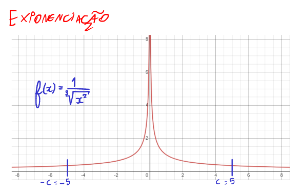

# Gauss Especiais

Existem alguns métodos de integração extras derivados do método de Gauss-Legendre.

A fórmula geral para **Gauss-Hermite** é:

$$\Large\boxed{I = \int_{-\infty}^{+\infty}e^{-x^2}f(x)dx \simeq \sum_{k = 1}^{n}w_kf(x_k)}$$

A fórmula geral para **Gauss-Laguerre** é:

$$\Large\boxed{I = \int_{0}^{+\infty}e^{-x}f(x)dx \simeq \sum_{k = 1}^{n}w_kf(x_k)}$$

A fórmula geral para **Gauss-Chebyshev** é:

$$\Large\boxed{I = \int_{-1}^{+1}\frac{1}{\sqrt{1-x^2}}f(x)dx \simeq \sum_{k = 1}^{n}w_kf(x_k)}$$

Cada fórmula possui seus polinômios, raízes e pesos diferentes.

## Tabela de polinômios

| $n$ (grau) | Hermite | Laguerre | Chebyshev |
| --- | --- | --- | --- |
| Polinomio | $\large H_x(x) = (-1)^ne^{x^2}\frac{d^n}{dx^n}e^{-x^2}$ | $\large L_n(x) = \frac{e^x}{n!}\frac{d^n}{dx^n}(e^{-x}x^n)$ | $\large T_n(x) = \frac{(-2)^nn!}{(2n)!}\sqrt{1-x^2}\frac{d^n}{dx^n}(1-x^2)^{n-\frac{1}{2}}$ |
| 0 | $\large H_0(x) = 1$ | $\large L_0(x) = 1$ | $\large T_0(x) = 1$ |
| 1 | $\large H_1(x) = 2x$ | $\large L_1(x) = -x+1$ | $\large T_1(x) = x$ |
| 2 | $\large H_2(x) = 4x^2-2$ | $\large L_2(x) = \frac{1}{2}(x^2-4x+2)$ | $\large T_2(x) = 2x^2-1$ |
| 3 | $\large H_3(x) = 8x^3-12x$ | $\large L_3(x) = \frac{1}{6}(-x^3+9x^2-18x+6)$ | $\large T_3(x) = 4x^3-3x$ |
| 4 | $\large H_4(x) = 4x^4 - 12x^2 + 3$ | $\large L_4(x) = \frac{1}{8}x^4-2x^3+9x^2-12x+3$ | $\large T_4(x) = 6x^4 - 4x^2 - 1$ |

Exemplo de como descobri o polinômio de grau 4 de Hermite

Exemplo de como descobri o polinômio de grau 4 de Chebyshev

## Raízes

### Hermite

- Grau 2:
    - $x_1 = -\frac{-1}{\sqrt{2}}$
    - $x_2 = +\frac{-1}{\sqrt{2}}$
- Grau 3:
    - $x_1 = -\sqrt{\frac{3}{2}}$
    - $x_2 = 0$
    - $x_3 = +\sqrt{\frac{3}{2}}$
- Grau 4:       
    - $x_1 = -(\sqrt{\frac{3}{2} + \frac{\sqrt{6}}{2}})$
    - $x_1 = -(\sqrt{\frac{3}{2} - \frac{\sqrt{6}}{2}})$
    - $x_1 = +(\sqrt{\frac{3}{2} - \frac{\sqrt{6}}{2}})$
    - $x_1 = +(\sqrt{\frac{3}{2} + \frac{\sqrt{6}}{2}})$

### Laguerre

- Grau 2:
    - $x_1 = 2-\sqrt{2}$
    - $x_2 = 2+\sqrt{2}$
- Grau 3 (PDF do Creto):
    - $x_1 = 0.4157745568$
    - $x_2 = 2.2942803603$
    - $x_3 = 6.2899450829$
- Grau 4 (Newton-Raphson):
    - $x_1 = 0.32254$
    - $x_2 = 1.74576$
    - $x_3 = 4.53662$
    - $x_4 = 9.39507$

### Chebyshev

- Grau 2:
    - $x_1 = -\frac{1}{\sqrt{2}}$
    - $x_2 = +\frac{1}{\sqrt{2}}$
- Grau 3:
    - $x_1 = -(\frac{\sqrt{3}}{2})$
    - $x_2 = 0$
    - $x_3 = +(\frac{\sqrt{3}}{2})$
- Grau 4:
    - $x_1 = -(\frac{\sqrt{2+\sqrt{2}}}{2})$
    - $x_1 = -(\frac{\sqrt{2-\sqrt{2}}}{2})$
    - $x_1 = +(\frac{\sqrt{2-\sqrt{2}}}{2})$
    - $x_1 = +(\frac{\sqrt{2+\sqrt{2}}}{2})$

Exemplo de como descobri as raizes grau 4 de Hermite:

Exemplo de como descobri as raízes grau 4 de Laguerre:

### Pesos

O pesos de Hermite são encontrados por:

$$\Large w_k = \int_{-\infty}^{\infty} e^{-x^2}Lagrange_k(x)dx \simeq \boxed{\frac{2^{n-1}n!\sqrt{\pi}}{n^2[H_{n-1}(x_i)]^2}}$$

Os pesos de Laguerre são encontrados por:

$$\Large w_k = \int_{0}^{+\infty}e^{-x}Lagrange_k(x)dx \simeq \boxed{\frac{x_i}{(n+1)^2[L_{n+1}(x_i)]^2}}$$

Os pesos de Chebyshev são encontrados por:

$$\Large w_k = \int_{-1}^{1}\frac{1}{\sqrt{1-x^2}}Lagrange_k(x)dx \simeq \boxed{\frac{\pi}{n}}$$

, onde $w_k$ são os pesos correspondentes a cada raíz $x_k$, $Lagrange_k$ é o polinômio interpolador de Lagrange, $H(x_i)$ é o polinômio de hermite, $L(x_i)$ é o polinômio de Laguerre, e $x_i$ sendo as raízes.

### Hermite

- Grau 2:
    - $w_1 = w_2 = \frac{\pi}{2}$
- Grau 3:
    - $w_1 = w_3 = \frac{\pi}{6}$
    - $w_2 = \frac{2\sqrt{\pi}}{3}$
- Grau 4:       
    - $w_1 = w_4 = \frac{\sqrt{\pi}}{4(3+\sqrt{6})}$
    - $w_2 = w_3 = -\frac{\sqrt{\pi}}{4(\sqrt{6}-3)}$

### Laguerre

- Grau 2:
    - $w_1 = \frac{1}{4}(2+\sqrt{2})$
    - $w_2 = \frac{1}{4}(2-\sqrt{2})$
- Grau 3 (PDF do Creto):
    - $w_1 = 0.7110930099$
    - $w_2 = 0.2785177336$
    - $w_3 = 0.0103892565$
- Grau 4:
    - $w_1 = 0.60312$
    - $w_2 = 0.35735$
    - $w_3 = 0.03889$
    - $w_4 = 0.00054$

### Chebyshev

- Grau 2:
    - $w_1 = w_2 = \frac{\pi}{2}$
- Grau 3:
    - $w_1 = w_2 = w_3 = \frac{\pi}{3}$
- Grau 4:
    - $w_1 = w_2 = w_3 = w_4 = \frac{\pi}{4}$

> Nota: o algoritmo para os gauss especiais estão no arquivo *trabalho_final/integration.py*

# Gauss-Exponenciação

O método de exponenciação, variante do método de Gauss-Legendre, serve para calcular a área de uma função com comportamento exponencial. Quando, em algum dos extremos do intervalo, ocorre pontos de singularidades derivados do comportamento natural da função, é preciso fazer uma mudança de variável e de limites de integração. Por conta disso, a função a ser integrada também muda.

Ou seja, fazemos isso daqui:

$$\Large \int_{a}^{b}f(x)dx = \int_{-\infty}^{\infty}f(x(s))\frac{dx(s)}{ds}ds$$

Perceba que eu faço uma mudança de variável, que resulta na mudança de intervalo de integração $[-\infty, +\infty]$, e também na mudança da função a ser integrada. Porém, não há uma maneira numérica de calcular a integral de intervalos infinitos. Porém, é possível obter uma aproximação. Como? Chutes. Chamaremos esse chute simétrico de "c", uma constante, que busca "simular" o resultado do que seria a integração no intervalo simétrico $[-\infty, +\infty]$.

$$\Large \int_{-\infty}^{\infty}f(x(s))\frac{dx(s)}{ds}ds \simeq \int_{-c}^{c}f(x(s))\frac{dx(s)}{ds}ds$$

Ou seja, agora assumimos um intervalo $[-c, +c]$, e esse resultado é muito próximo do resultado analítico para pontos de singularidade. O chute "c" precisa ser pequeno inicialmente, 1,2,3... até obter um resultado satisfatório. Tomar cuidado com o valor alto dele é essencial, pois pode em algum momento resultar em divisão por zero, e isso ficará claro depois.

O que importa é que agora precisamos saber os valores de $x(s)$, $\frac{dx(s)}{ds}$ e $s$, tanto para exponencial simples quanto dupla.

O $s$ é aplicado tanto para exponencial simples quanto dupla, e é basicamente o antigo $x(a)$ de Gauss-Legendre. Aqui chamamos de $s$ para diferenciar do que será mostrada a função $x$, pois $x$ utilizando na exponenciação é completamente diferente.

$$\boxed{s = \frac{x_i+x_f}{2} + \frac{x_f-x_i}{2} \cdot a_k}$$

, onde:
- $s$ é a função $s(a_k)$ (antiga $x(a_k)$ de Gauss-Legendre);
- $x_i$ é o intervalo inicial da partição do problema (se não tiver partição, é o próprio $-c$);
- $x_f$ é o intervalo final da partição do problema (se não tiver partição, é o próprio $+c$);
- $a_k$ é a raíz do polinômio de legendre respectivo do termo, onde $k$ é a numeração da raíz. Se aplicar quarto grau, então $k$ varia de 1 a 4.

## Exponencial Simples

As fórmulas são as seguintes:

$$\boxed{\Large x(s) = \frac{a+b}{2}+\frac{b-a}{2}\cdot \tanh(s)}$$

E a derivada de $x(s)$ com relação a $s$ é:

$$\boxed{\Large \frac{dx(s)}{ds} = \frac{b-a}{2}\cdot \frac{1}{[\cosh(s)]^2}}$$

, onde:
- $s = s(a_k)$;
- $a$ e $b$ são os intervalos de integração **originais** do problema (antes da mudança de variáveis).

## Exponencial Dupla

As fórmulas são as seguintes:

$$\boxed{\Large x(s) = \frac{a+b}{2}+\frac{b-a}{2}\cdot \tanh\left(\frac{\pi}{2}\sinh(s)\right)}$$

E a derivada de $x(s)$ com relação a $s$ é:

$$\boxed{\Large \frac{dx(s)}{ds} = \frac{b-a}{2}\cdot \left[\frac{\pi}{2}\cdot \frac{\cosh(s)}{\left[\cosh\left(\frac{\pi}{2}\cdot\sinh(s)\right)\right]^2}\right]}$$

## Conclusão

Cuidado na escolha do "c"! E não confundir o $a$ e $b$ de $x(s(a_k))$ com o $c$ de $s(a_k)$, pois no último caso o $c$ é um intervalo pós-mudança de variável, enquanto que $a$ e $b$ são da pré-mudança.

E observe que na exponencial dupla, o $\sinh$ é uma função trigonométrica exponencial que, com baixo valor no input, pode levar a números astronômicos. E logo depois há uma operação com $\tanh$, que possui em seus extremos pontos singulares de -1 a 1. Então quanto maior for o valor de $\tanh$, mais se aproxima de 1. Porém, o número de input na $\tanh$ basta ser, por exemplo, 10, que o resultado é 0.999999995. O que isso significa? Que se a $\tanh$ passar de 13, qualquer calculadora, incluindo a do google, ou até mesmo as científicas, não irão computar 0.9999999999..., e sim simplesmente 1, devido a uma aproximação de float resultante de um overflow. E o perigo disso é que pode ocorrer divisão por zero no cálculo de $f$ nos termos de Gauss-Legendre.