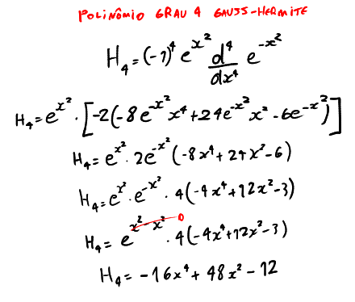
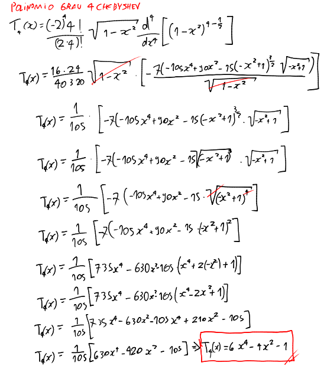
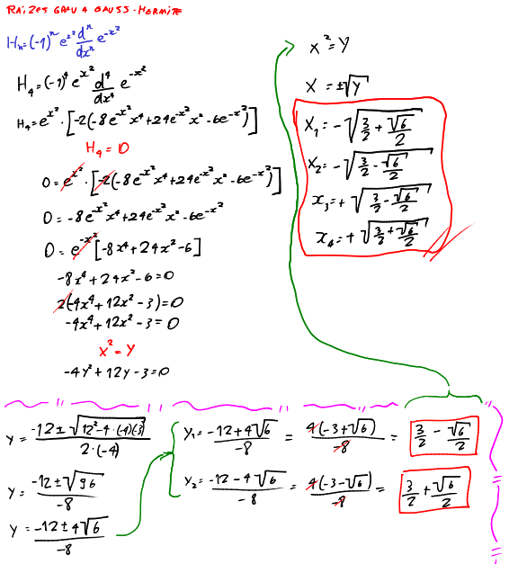
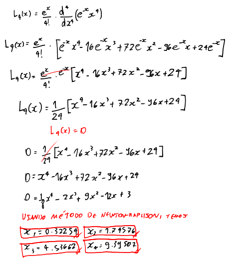

# Gauss Especiais

Existem alguns métodos de integração extras derivados do método de Gauss-Legendre.

A fórmula geral para **Gauss-Hermite** é:

$$\Large\boxed{I = \int_{-\infty}^{+\infity}e^{-x^2}f(x)dx \simeq \sum_{k = 1}^{n}w_kf(x_k)}$$

A fórmula geral para **Gauss-Laguerre** é:

$$\Large\boxed{I = \int_{0}^{+\infty}e^{-x}f(x)dx \simeq \sum_{k = 1}^{n}w_kf(x_k)}$$

A fórmula geral para **Gauss-Chebyshev** é:

$$\Large\boxed{I = \int_{-1}^{+1}\frac{1}{\sqrt{1-x^2}}f(x)dx \simeq \sum_{k = 1}^{n}w_kf(x_k)}$$

Cada fórmula possui seus polinômios, raízes e pesos diferentes.

## Tabela de polinômios

| $n$ (grau) | Hermite | Laguerre | Chebyshev |
| --- | --- | --- | --- |
| Polinomio | $\large H_x(x) = (-1)^ne^{x^2}\frac{d^n}{dx^n}e^{-x^2}$ | $\large L_n(x) = \frac{e^x}{n!}\frac{d^n}{dx^n}(e^{-x}x^n)$ | $\large T_n(x) = \frac{(-2)^nn!}{(2n)!}\sqrt{1-x^2}\frac{d^n}{dx^n}(1-x^2)^{n-\frac{1}{2}}$ |
| 0 | $\large H_0(x) = 1$ | $\large L_0(x) = 1$ | $\large T_0(x) = 1$ |
| 1 | $\large H_1(x) = 2x$ | $\large L_1(x) = -x+1$ | $\large T_1(x) = x$ |
| 2 | $\large H_2(x) = 4x^2-2$ | $\large L_2(x) = \frac{1}{2}(x^2-4x+2)$ | $\large T_2(x) = 2x^2-1$ |
| 3 | $\large H_3(x) = 8x^3-12x$ | $\large L_3(x) = \frac{1}{6}(-x^3+9x^2-18x+6)$ | $\large T_3(x) = 4x^3-3x$ |
| 4 | $\large H_4(x) = 4x^4 - 12x^2 + 3$ | $\large L_4(x) = \frac{1}{8}x^4-2x^3+9x^2-12x+3$ | $\large T_4(x) = 6x^4 - 4x^2 - 1$ |

Exemplo de como descobri o polinômio de grau 4 de Hermite

Exemplo de como descobri o polinômio de grau 4 de Chebyshev

## Raízes

### Hermite

- Grau 2:
    - $x_1 = -\frac{-1}{\sqrt{2}}$
    - $x_2 = +\frac{-1}{\sqrt{2}}$
- Grau 3:
    - $x_1 = -\sqrt{\frac{3}{2}}$
    - $x_2 = 0$
    - $x_3 = +\sqrt{\frac{3}{2}}$
- Grau 4:       
    - $x_1 = -(\sqrt{\frac{3}{2} + \frac{\sqrt{6}}{2}})$
    - $x_1 = -(\sqrt{\frac{3}{2} - \frac{\sqrt{6}}{2}})$
    - $x_1 = +(\sqrt{\frac{3}{2} - \frac{\sqrt{6}}{2}})$
    - $x_1 = +(\sqrt{\frac{3}{2} + \frac{\sqrt{6}}{2}})$

### Laguerre

- Grau 2:
    - $x_1 = 2-\sqrt{2}$
    - $x_2 = 2+\sqrt{2}$
- Grau 3 (PDF do Creto):
    - $x_1 = 0.4157745568$
    - $x_2 = 2.2942803603$
    - $x_3 = 6.2899450829$
- Grau 4 (Newton-Raphson):
    - $x_1 = 0.32254$
    - $x_2 = 1.74576$
    - $x_3 = 4.53662$
    - $x_4 = 9.39507$

### Chebyshev

- Grau 2:
    - $x_1 = -\frac{1}{\sqrt{2}}$
    - $x_2 = +\frac{1}{\sqrt{2}}$
- Grau 3:
    - $x_1 = -(\frac{\sqrt{3}}{2})$
    - $x_2 = 0$
    - $x_3 = +(\frac{\sqrt{3}}{2})$
- Grau 4:
    - $x_1 = -(\frac{\sqrt{2+\sqrt{2}}}{2})$
    - $x_1 = -(\frac{\sqrt{2-\sqrt{2}}}{2})$
    - $x_1 = +(\frac{\sqrt{2-\sqrt{2}}}{2})$
    - $x_1 = +(\frac{\sqrt{2+\sqrt{2}}}{2})$

Exemplo de como descobri as raizes grau 4 de Hermite:

Exemplo de como descobri as raízes grau 4 de Laguerre:

### Pesos

O pesos de Hermite são encontrados por:

$$\Large w_k = \int_{-\infty}^{\infty} e^{-x^2}Lagrange_k(x)dx \simeq \boxed{\frac{2^{n-1}n!\sqrt{\pi}}{n^2[H_{n-1}(x_i)]^2}}$$

Os pesos de Laguerre são encontrados por:

$$\Large w_k = \int_{0}^{+\infty}e^{-x}Lagrange_k(x)dx \simeq \boxed{\frac{x_i}{(n+1)^2[L_{n+1}(x_i)]^2}}$$

Os pesos de Chebyshev são encontrados por:

$$\Large w_k = \int_{-1}^{1}\frac{1}{\sqrt{1-x^2}}Lagrange_k(x)dx \simeq \boxed{\frac{\pi}{n}}$$

, onde $w_k$ são os pesos correspondentes a cada raíz $x_k$, $Lagrange_k$ é o polinômio interpolador de Lagrange, $H(x_i)$ é o polinômio de hermite, $L(x_i)$ é o polinômio de Laguerre, e $x_i$ sendo as raízes.

### Hermite

- Grau 2:
    - $w_1 = w_2 = \frac{\pi}{2}$
- Grau 3:
    - $w_1 = w_3 = \frac{\pi}{6}$
    - $w_2 = \frac{2\sqrt{\pi}}{3}$
- Grau 4:       
    - $w_1 = w_4 = \frac{\sqrt{\pi}}{4(3+\sqrt{6})}$
    - $w_2 = w_3 = -\frac{\sqrt{\pi}}{4(\sqrt{6}-3)}$

### Laguerre

- Grau 2:
    - $w_1 = \frac{1}{4}(2+\sqrt{2})$
    - $w_2 = \frac{1}{4}(2-\sqrt{2})$
- Grau 3 (PDF do Creto):
    - $w_1 = 0.7110930099$
    - $w_2 = 0.2785177336$
    - $w_3 = 0.0103892565$
- Grau 4:
    - $w_1 = 0.60312$
    - $w_2 = 0.35735$
    - $w_3 = 0.03889$
    - $w_4 = 0.00054$

### Chebyshev

- Grau 2:
    - $w_1 = w_2 = \frac{\pi}{2}$
- Grau 3:
    - $w_1 = w_2 = w_3 = \frac{\pi}{3}$
- Grau 4:
    - $w_1 = w_2 = w_3 = w_4 = \frac{\pi}{4}$