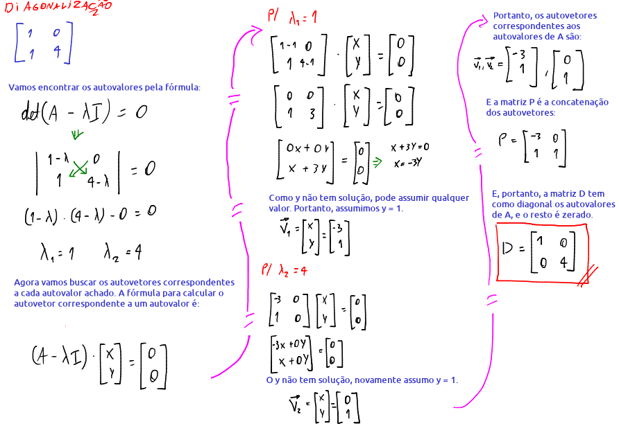
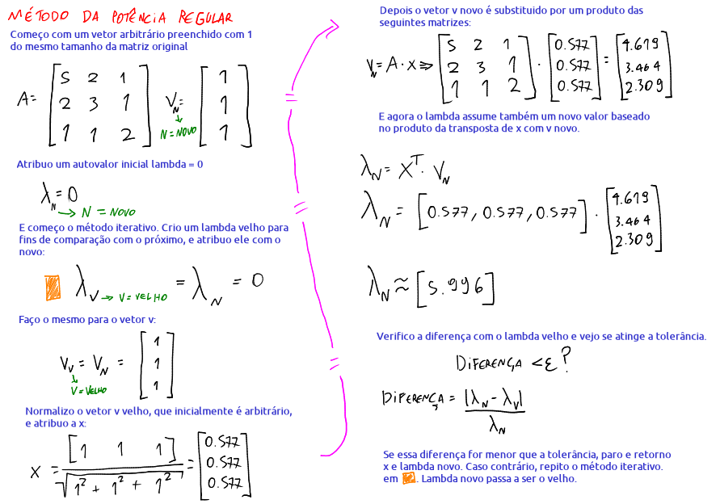

# Autovalores e Autovetores

Toda matriz $A$ quadrada tem autovalores $\lambda$ e seus correspondentes autovetores $x$, desde que ela seja diagonalizável. Uma matriz diagonal é quando os números de cima-direito e embaixo-esquerdo são zeros. Exemplo:

$$
\begin{bmatrix}
2 & 0 & 0 \\
0 & 1 & 0 \\
0 & 0 & -1
\end{bmatrix}
$$

é uma matriz diagonal.

Uma matriz qualquer $A$ pode ser diagonalizada se existe alguma matriz P invertível (ou seja, que tem inversa) tal que se multiplicar $P^{-1}$ pela matriz a ser diagonalizada, e depois multiplicar por $P$, resulta em $A$ diagonalizada. 

Ou seja, uma matriz $A$ é diagonalizável se:

$$\boxed{P^{-1}\cdot A\cdot P = D}$$

, onde $D$ é a versão diagonalizada da matriz $A$, e $P$ são os autovetores da matriz $A$ concatenados.

Ou seja, isso é equivalente a dizer que

$$\boxed{A = P\cdot D\cdot P^{-1}}$$

Essa fórmula acima também pode ser definida como a **decomposição espectral** da matriz $A$.

### Exemplo:

Diagonalizar essa matriz: 
$
\begin{bmatrix}
1 & 0 \\
1 & 4
\end{bmatrix}
$

# Método da Potência Regular

O método da potência busca encontrar numericamente o autovalor dominante de uma matriz e o autovetor associado a esse autovalor.

# Método da Potência Inversa